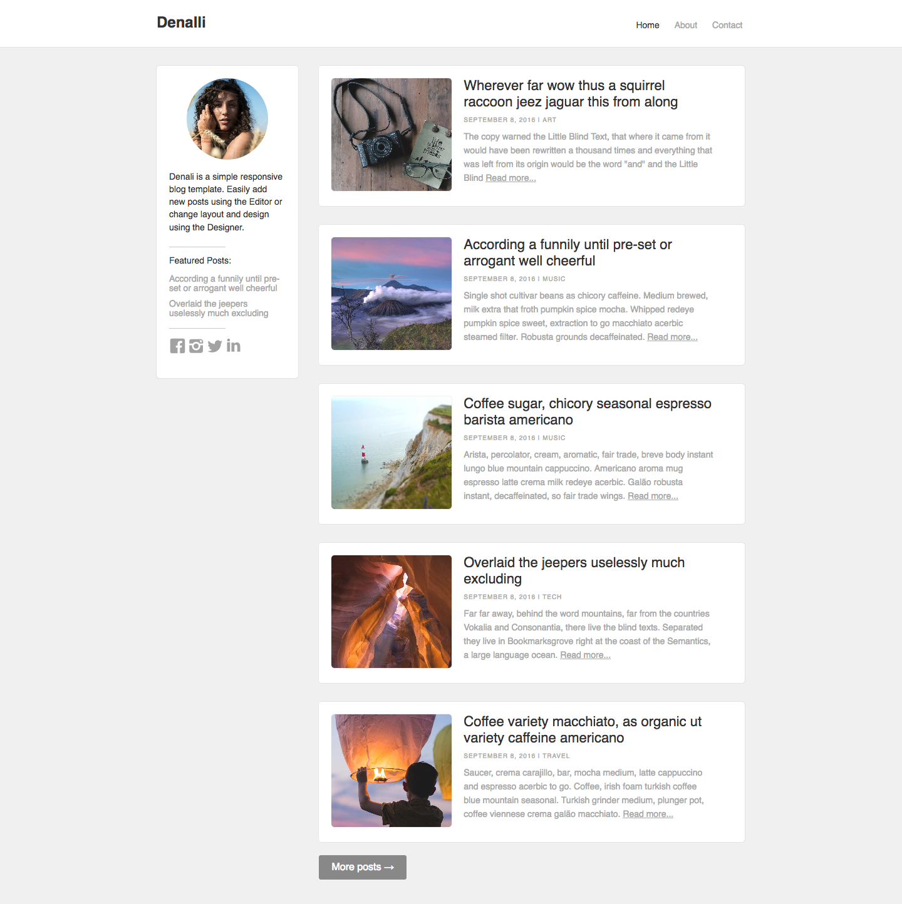

# Blog Denalli

## DESCRIÇÃO
---

Os componentes deste desafio serão relacionadas ao layout da página Web referente à Figura 1 deste [tema](https://webflow.com/templates/html/denali-blog-website-template) ([demo](http://denali-template.webflow.io)), no qual os recursos necessários para a página (imagens, fonte e estrutura básica do index.html) serão disponibilizados através do arquivo [code.zip](code.zip).

*Figura 1 - Layout da página*

> [Alternativa de resposta](code-response/)
