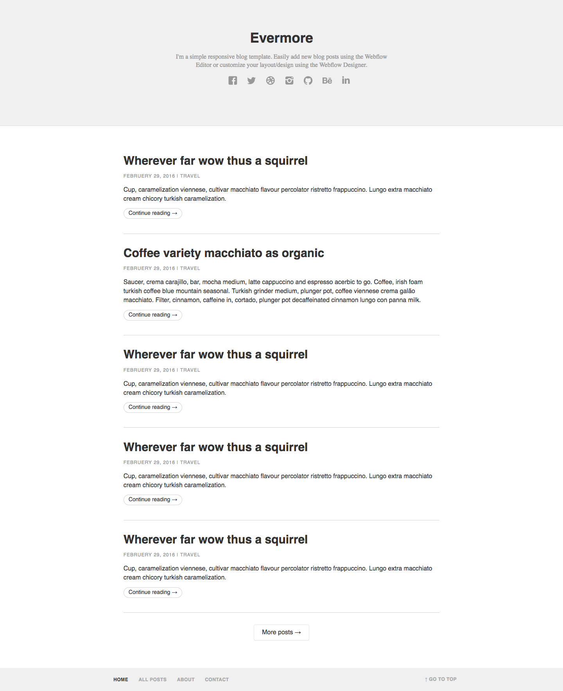
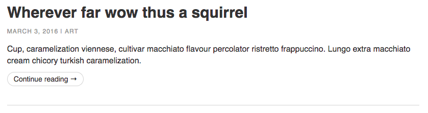
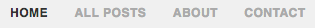
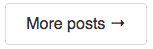
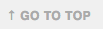

# Blog Evermore

## DESCRIÇÃO
---

Os componentes deste desafio serão relacionadas ao layout da página Web referente à Figura 1 deste [tema](https://webflow.com/templates/html/evermore-blog-website-template) ([demo](http://evermore-template.webflow.io)), no qual os recursos necessários para a página (imagens, fonte e estrutura básica do index.html) serão disponibilizados através do arquivo [code.zip](code.zip).

*Figura 1 - Layout da página*

Resumidamente o layout é dividido em três áreas principais, começando com o cabeçalho, corpo, e finalizando com o rodapé. Cada uma dessas áreas apresentam componentes com aparências específicas, que devem preservar o mais próximo possível do comportamento  estrutural e o estilo da realidade apresentada na Figura 1.

Cada componente abordará um item específico, no qual seu conteúdo será previamente disponibilizado por meio do arquivos baixados. Por exemplo, uma das questões solicitará a criação e estilização dos artigos, e como ponto de partida, os arquivos baixados já oferecem o conteúdo de cada artigo, como exibido a seguir para o primeiro artigo:

> Wherever far wow thus a squirrel 
> Februery 29, 2016 
> Travel 
> Cup, caramelization viennese, cultivar macchiato flavour percolator ristretto frappuccino. Lungo extra macchiato cream chicory turkish caramelization. 
> Continue reading → 

para que seja utilizado na criação da estrutura do HTML e estilização do CSS.

## Componentes
---

**COMPONENTE 1 -** No Layout da Figura 1 é possível identificar que existe uma séria de cinco artigos no corpo principal da página, e basicamente todos seguem o mesmo estilo. Através dos arquivos obtidos, veja que o layout não apresenta nem HTML e nem CSS dos artigos. Então, crie a aparência dos artigos conforme a Figura 2 considerando que:

  * O título e o texto "continue reading" são links para o artigo no blog;
  * O texto "ART" após a data de publicação também é um link para indicar a categoria do artigo, e possui `#969696` de cor;
  * Os links dentro da área do artigo não possuem sublinhado;
  * O título apresenta cor de `#333` e tamanho de texto de `30px`;
  * A data de publicação e a categoria possuem a cor `#969696`, tamanho de fonte `12px`, tamanho de linha de `125%`, espaçamento entre letras de `1px` e o texto em caixa alta;
  * O tamanho da linha do parágrafo de descrição do artigo é de `144%`;
  * O link "continue reading" possui borda arredondada de `20px`, tamanho de fonte de `14px`, cor de `#333`, e bordar solida com `1px` de tamanho e `#d3d3d3` de cor;
  * Cada artigo possui uma borda inferior sólida de `1px` de tamanho e `#d3d3d3` de cor;
  * Os espaçamentos entre os elementos devem ser personalizados.

  *Figura 2 - Aparência do artigo.* 
  

**COMPONENTE 2 -** Outro componente importanto do layout da Figura 1 é acesso das redes sociais do blog que fica no cabeçalho da página, apresentado através do recorte da Figura 3. Todas as imagens necessários para essa nevegação estão disponibilizadas, mas será preciso que:

  * A listagem das imagens seja realizada através de links;
  * Cada imagem possua um tamanho de `24px`;
  * A princípio cada imagem apresente a opacidade de `0.36`;
  * A opacidade nas imagens deve ser de 1 quando o cursor estiver sobre a imagem, para que assim seja possível obter o efeito da imagem do facebook na Figura 3.

  *Figura 3 - Opções de acesso das redes sociais.* 
   
  

**COMPONENTE 3 -** Na parte inferior da página da Figura 1 existe um menu de acesso a outras páginas do blog, no rodapé, conforme destaca a Figura 4. Para criar esse menu observe que:

  * Os links estão dispostos sob uma lista;
  * Todo o texto deve estar em caixa alta;
  * O tamanho de texto é de `12px`;
  * A cor do texto é de #aaa, mas quando o cursor está sob o link a cor será de `#333`;
  * O primeiro link deve ser marcado com a classe `.active`, que define sua cor como `#333`.

  *Figura 4 - Menu de navegação.* 
  

**COMPONENTE 4 -** Para realizar a paginação entre os vários artigos de um blog o layout da Figura 1 idealizou uma área que fica próximo ao rodapé. A Figura 5 recorta especificamente a aparência de como deve ser a paginação. Portanto, tente criar esse paginação considerando que:

  * O botão será feito através de um link que ficará centralizado em relação aos artigos;
  * O raio da borda é de `3px`;
  * A cor do texto é `#333`;
  * O tamanho da fonte é de `16px`;
  * O tamanho da linha é de `20px`;
  * A sobra da borda sejá de `0 0 0 1px #ddd`.

  *Figura 5 - Paginação dos artigos.* 
  

**COMPONENTE 5 -** Por fim, um recurso de navagação presente na Figura 1 é o link destacado na Figura 6 que rediciona a página para o topo. Para constriur essa navegação será preciso que:

  * O tamanho da fonte seja de `12px`;
  * O espaçamento entre as letras seja de `0.5px`;
  * O texto fique em caixa alta;
  * A cor do texto seja de `#aaa`, mas quando o cursor ester sob o link a será de `#333`.

  *Figura 6 - Botão de acesso superior da página.* 
  

> [Alternativa de resposta](code-response/)