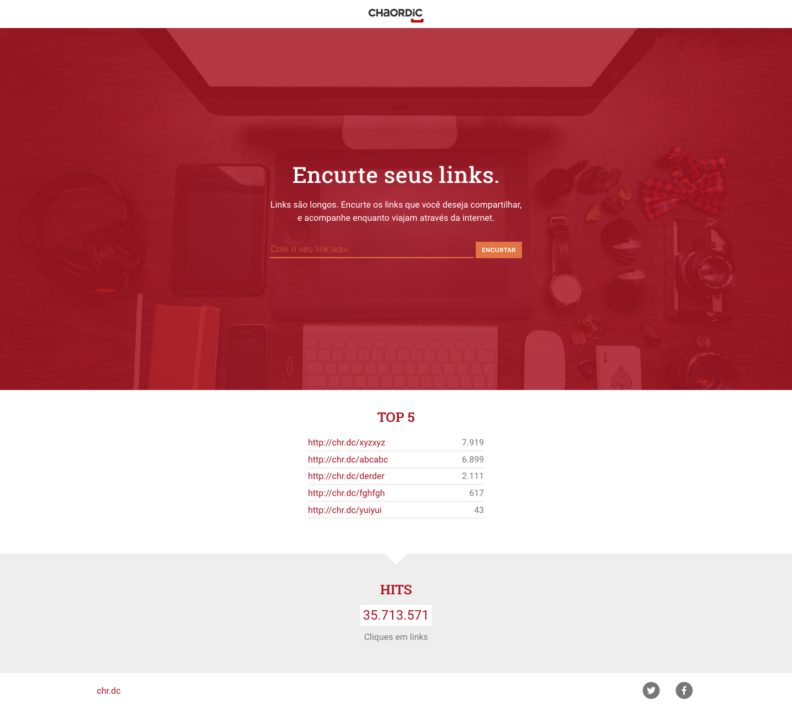
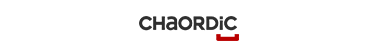
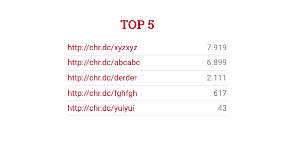
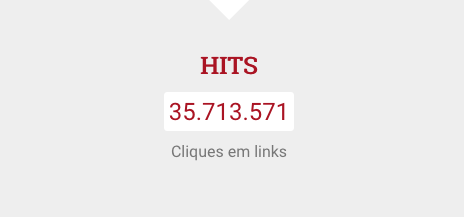

# Desafio do Chaordic

## Descrição
---

A empresa [Chaordic](https://github.com/chaordic/frontend-intern-challenge) está buscando profissionais para o preenchimento de vagas de Front-end. Para auxiliar o processo de contratação foi desenvolvido um desafio que exige a criação de alguns componentes visuais, que serão descritos a seguir, no layout do site da Figura 1.

*Figura 1 - Layout do site*<br>


A princípio já foi disponibilizado uma estrutura básica do site que se encontra no arquivo [code.zip](code.zip), e é exigido a criação de no mínimo 3 componentes.


## Componentes
---

**COMPONENTE 1 -** Crie o cabeçalho do site conforme ilustra a *Figura 2*: 

*Figura 2 - Cabeçalho do site*<br>


Contudo, considere os seguintes itens:

- Adicione a imagem `img/logo-chaordic.png` na página `index.html` em `<!-- TODO header -->`;
- No arquivo `css/master.css` em `/* header */` posicione  a imagem de modo centralizado, e adicione os recuos necessário para a imagem não ficar tão próxima das bordas.

**COMPONENTE 2 -** Crie o banner do site conforme ilustra a *Figura 3*: 

*Figura 3 - Banner*<br>


Contudo, considere os seguintes itens:

- Adicione o conteúdo a seguir na página `index.html` em `<!-- TODO banner -->`:

```
Encurte seus links.
Links são longos. Encurte os links que você deseja compartilhar, e acompanhe enquanto viajam através da internet.
```

- No arquivo `css/master.css` em `/* banner */` estilize:
  - O texto para ficar branco;
  - O título para possuir a fonte `'Roboto Slab', serif`;
  - O título para possuir o tamanho de `2.5rem`;
  - A altura de linha do parágrafo com `1.5rem`;
  - Tente preservar o alinhamento dos conteúdos internos.

**COMPONENTE 3 -** Crie a seção TOP 5 do site conforme ilustra a *Figura 4*: 

*Figura 4 - Top 5*<br>


Contudo, considere os seguintes itens:

- Adicione o conteúdo a seguir na página `index.html` em `<!-- TODO top 5 -->`:

```
http://chr.dc/xyzxyz 7.919
http://chr.dc/abcabc 6.899
http://chr.dc/derder 2.111
http://chr.dc/fghfgh 617
http://chr.dc/yuiyui 43
```

- No arquivo `css/master.css` em `/* top 5 */` estilize:
  - O título para possuir a fonte `'Roboto Slab', serif`, a cor de texto de `#aa1423` e aplique caixa alta no texto;
  - Os links e números com borda inferior de `solid 2px #eee`;
  - Os números com a cor `#777`;
  - Todos os links para possuir a cor `#aa1423` e aplicar o sublinhado apenas quando o cursor estiver sobre o link;
  - Tente preservar o alinhamento dos conteúdos internos.

**COMPONENTE 4 -** Crie a seção Hits do site conforme ilustra a *Figura 5*:

*Figura 5 - Hits*<br>


- Adicione o conteúdo a seguir na página `index.html` em `<!-- TODO hits -->`:

```
35.713.571
Cliques em links
```

- No arquivo `css/master.css` em `/* hits */` estilize:
  - O título para possuir a fonte `'Roboto Slab', serif`, a cor de texto de `#aa1423` e aplique caixa alta no texto;
  - O número com a cor `#aa1423`, plano de fundo branco, tamanho de texto de `1.5rem` e raio da borda com `3px`;
  - A cor do texto inferior deve ser `#777`;
  - Tente preservar o alinhamento dos conteúdos internos.

<br>
<br>
<br>

> [Alternativa de resposta](code-response/)