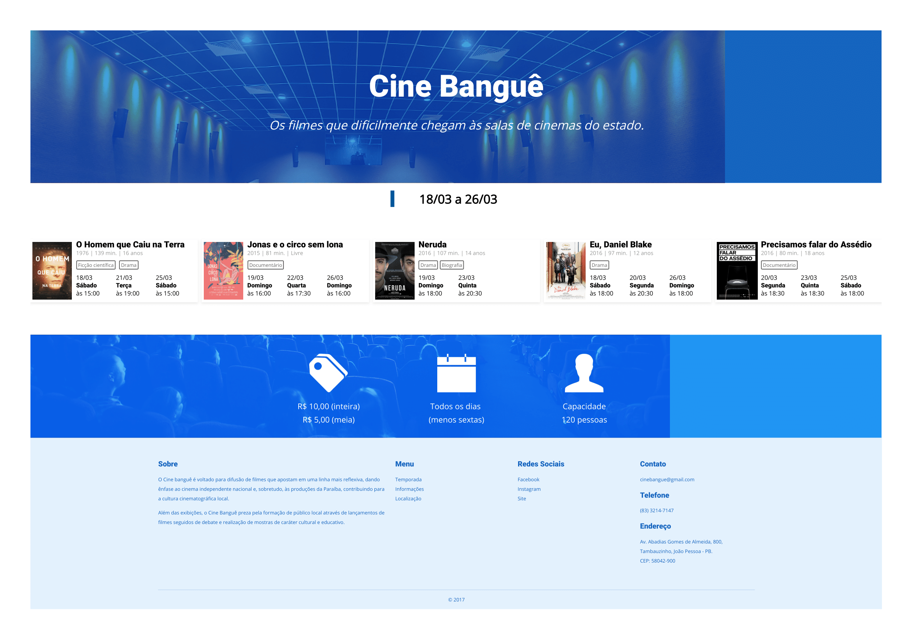
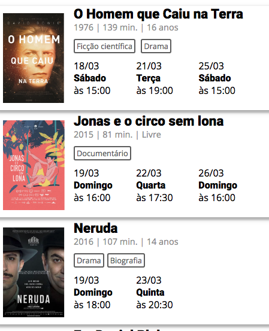
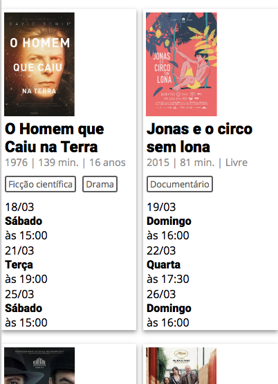
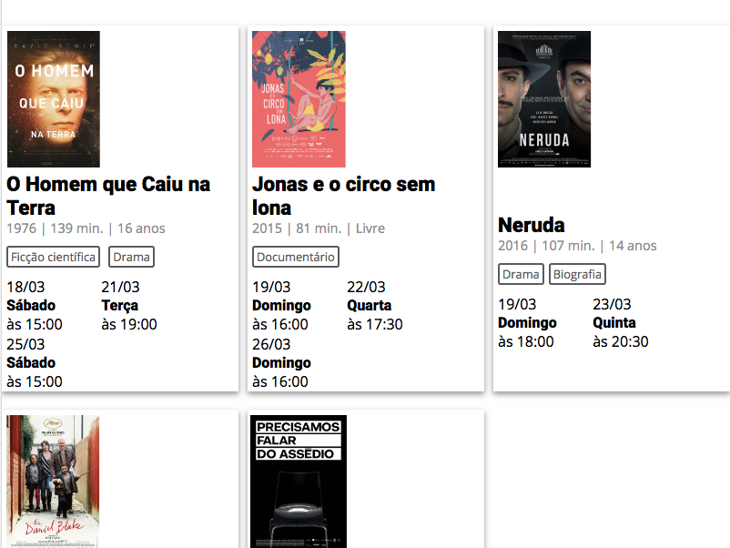
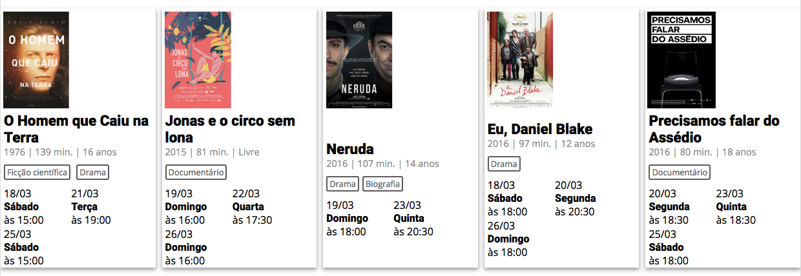
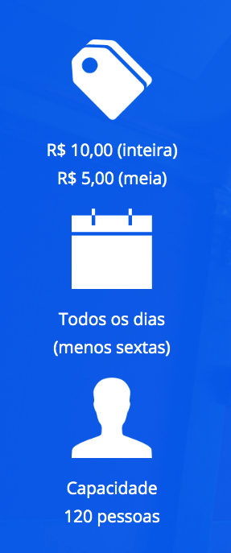

# Cinebangue - FINAL

## DESCRIÇÃO
---

A estrutura básica do site se encontra no arquivo [site.zip](site.zip), e é exigida a criação de TODOS os componentes.

Ao final, o site terá o seguinte aspecto (resolução >= `1200px`):

 

## COMPONENTES
---

**COMPONENTE 1 -** Animação do Banner.

A animação deve ficar igual ao vídeo abaixo:

*Vídeo 1 - Animação Banner Principal (No Google Chrome você deve acionar o play)* 
<video width="100%" height="100%" autoplay loop controls>
  <source src="assets/banner.mp4" type="video/mp4">
</video>

No arquivo `main.css`, mais especificamente na área `/* TODO COMPONENTE 1 */`, criar a animação de acordo com as características abaixo:

* A animação tem duração de `5s` e é `linear`;
* A escala vai de `0` a `1`;
* Transparência indo de `0` a `1`;
* Posicionamento `cima` indo de `100px` a `0px`;

**COMPONENTE 2 -** Efeito nas imagens dos cards.

Quando o mouse passar por cima das imagens, elas terão o efeito do vídeo 2:

*Vídeo 2 - Efeito das imagens dos Cards (No Google Chrome você deve acionar o play)* 
<video width="100%" height="100%" autoplay loop controls>
  <source src="assets/cards.mp4" type="video/mp4">
</video>

No arquivo `main.css`, mais especificamente na área `/* TODO COMPONENTE 2 */`, montar o efeito com as características abaixo:

* Tamanho da fonte de `2em`;
* Borda arredondada;
* Cor branca;
* Altura da linha de `150px`;
* Alinhamento central;
* Cor do fundo igual a `#0288D1`;
* Modo de mesclagem do fundo igual a `overlay`;

**COMPONENTE 3 -** Responsividade dos Cards.

Os cards inicialmente devem ter a seguinte configuração:

*Figura 1 - Cards versão Mobile* 
 

* Gap de `10px`;
* Alinhamento centralizado;

Depois de organizar os cards para a versão mobile, transforme a página de forma a ficar responsiva nas sequintes resoluções: `400px` (Figura 1a), `800px` (Figura 1b) e `1200px` (Figura 1c):

* No arquivo `main.css`, especificamente em `/* TODO COMPONENTE 3 */`, faça as seguintes alterações, mostradas nas figuras abaixo:

*Figura 1a (`400px`)* 
 
*Figura 1b (`800px`)* 
 
*Figura 1c (`1200px`)* 

**COMPONENTE 3 -** Responsividade das Informações.

As informações possuem as seguintes configurações iniciais:

*Figura 2 - Configuração inicial das Infos* 
 

Depois da configuração inicial, transforme a página de forma a ficar responsiva nas sequintes resoluções: `350px`, `700px` e `1000px`.

No arquivo `main.css`, especificamente em `/* TODO COMPONENTE 4 */`, faça as seguintes alterações:

* A partir da resolução de `350px`, modifique o alinhamento para centralizado e espaçamento ao redor das infos;

* A partir da resolução de `700px`, modifique o fluxo para linha;

* A partir da resolução de `1000px`, modifique o espaçamento para entre as infos;