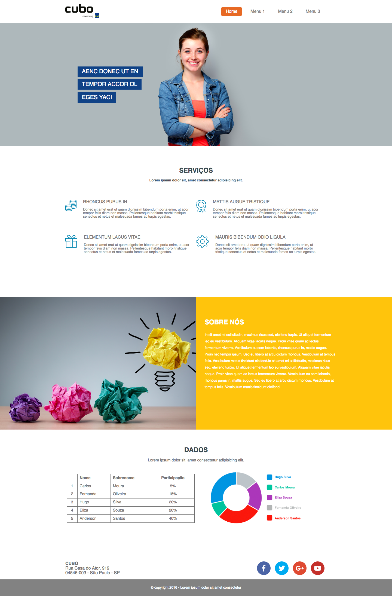
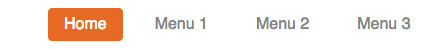
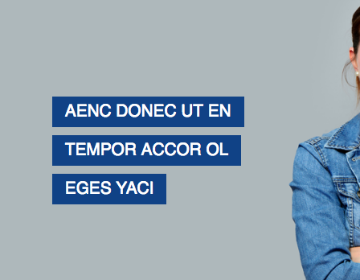
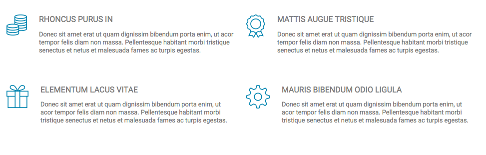
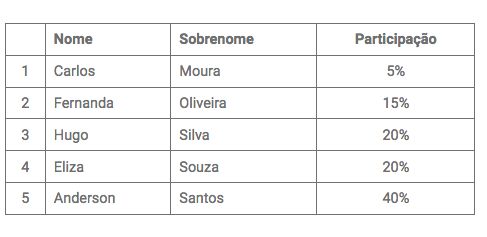

# Desafio do Cubo Network

## Descrição
---

A empresa [Cubo Network](https://github.com/cubonetwork/frontend-challenge) está buscando profissionais para o preenchimento de vagas de Front-end. Para auxiliar o processo de contratação foi desenvolvido um desafio que exige a criação de alguns componentes visuais, que serão descritos a seguir, do layout do site da Figura 1.

*Figura 1 - Layout do site*<br>


A princípio já foi disponibilizado uma estrutura básica do site que se encontra no arquivo [site.zip](site.zip), e é exigido a criação de no mínimo 3 componentes.

## Componentes
---

**COMPONENTE 1 -** Crie a barra de menu conforme ilustra a *Figura 2*: 

*Figura 2 - Barra de menu*<br>


Contudo, considere os seguintes itens:

* No arquivo `index.html`, especificamente em `<!-- TODO Barra de menu -->` dentro do elemento `<nav>`, crie a lista de itens do menu usando a estrutura:

  ```html
  <ul>
    <li><a href="#">Texto 1</a></li>
    ...
    <li><a href="#">Texto N</a></li>
  </ul>
  ```

* No arquivo `css/master.css`, especificamente em `/* TODO Barra de menu */`, faça que os links da barra de menu possuam margens laterais de `.5rem`, recuo interno nas verticais de `.5rem` e nas horizontais de `1rem`, remova o sublinhado dos hyperlinks, e coloque a cor `#868686`;

* A primeira opção do menu na *Figura 2* deve estar em destaque com a aparência diferente dos demais usando a cor do plano de fundo de `#e76924`, a cor de texto branca e com arredondamento de borda (`border-radius: 4px`).

**COMPONENTE 2 -** Estilize o texto do banner conforme ilustra a *Figura 3*:

*Figura 3 - Texto dos banners*<br>


Contudo, considere os seguintes itens:

* O código HTML do texto já está assim:

  ```html
  <section class="slide">
    <div class="container">
      <p>Aenc donec ut en</p>
      <p>tempor accor ol</p>
      <p>eges yaci</p>
    </div>
  </section>
  ```

* Estilize os parágrafos do código anterior, no arquivo `css/master.css`, em `/* TODO texto do banner */`, de modo que exista um distanciamento entre os `<p>` de `.3rem`, cada `<p>` possua um recuo interno de `.5rem 1rem`, o plano de fundo seja de `#104286`, o texto do `<p>` possua a cor branca, tamanho de `1.3rem` e seja convertido para maiúsculo. 

**COMPONENTE 3 -** Estilize a lista de serviços conforme ilustra a *Figura 4*:

*Figura 4 - Serviços*<br>


Contudo, considere os seguintes itens:

* Em `<!-- TODO Serviços -->`, no arquivo `index.html`, cada serviço deve apresentar a estrutura HTML a seguir:

  ```html
  <div class="service">
    <div class="logo">
      
    </div>
    <div class="description">
      <h1>Rhoncus purus in</h1>
      <p>Donec sit amet erat ut quam dignissim bibendum porta enim, ut acor tempor felis diam non massa. Pellentesque habitant morbi tristique senectus et netus et malesuada fames ac turpis egestas.</p>
    </div>
  </div>
  ```

  sendo o conteúdo de cada serviço assim:

  ```
  img/service1.png
  Rhoncus purus in
  Donec sit amet erat ut quam dignissim bibendum porta enim, ut acor tempor felis diam non massa. Pellentesque habitant morbi tristique senectus et netus et malesuada fames ac turpis egestas.

  img/service2.png
  Mattis augue tristique
  Donec sit amet erat ut quam dignissim bibendum porta enim, ut acor tempor felis diam non massa. Pellentesque habitant morbi tristique senectus et netus et malesuada fames ac turpis egestas.

  img/service3.png
  Elementum lacus vitae
  Donec sit amet erat ut quam dignissim bibendum porta enim, ut acor tempor felis diam non massa. Pellentesque habitant morbi tristique senectus et netus et malesuada fames ac turpis egestas.

  img/service4.png
  Mauris bibendum odio ligula
  Donec sit amet erat ut quam dignissim bibendum porta enim, ut acor tempor felis diam non massa. Pellentesque habitant morbi tristique senectus et netus et malesuada fames ac turpis egestas.
  ```

* No arquivo `css/master.css`, em `/* TODO Serviços */`, evite que o `<h1>` e o `<p>` se aproxime de seu elemento pai, o `<div class="description">`, usando um distanciamento na horizontal de `1.5rem`;
* O título `<h1>` deve zerar sua margem e estilizar o texto com tamanho de `1rem`, peso normal e seja convertido para maiúsculo;
* O tamanho do `<p>` deve ser de `.8rem`.

**COMPONENTE 4 -** Estilize a tabela conforme ilustra a *Figura 5*:

*Figura 5 - Tabela*<br>


Contudo, considere os seguintes itens:

* Em `<!-- TODO Tabela -->` no arquivo `index.html`, crie a tabela HTML usando o seguinte conteúdo:

  ```
    Nome      Sobrenome   Participação
  1 Carlos    Moura       5%
  2 Fernanda  Oliveira    15%
  3 Hugo      Silva       20%
  4 Eliza     Souza       20%
  5 Anderson  Santos      40%
  ```

* Em `/* TODO table */`, no arquivo `css/master.css`, estilize a tabela com a largura de `49%`, e margem de `.5%`;
* O alinhamento das colunas deve ser preservado;
* Cada célula deve possuir recuo interno de `.4rem .5rem`, e borda de `1px solid #707070`

**COMPONENTE 5 -** Estilize os ícones das redes sociais conforme ilustra a *Figura 6*:

*Figura 6 - Redes sociais*<br>


Contudo, considere os seguintes itens:

* No arquivo `index.html`, especificamente dentro do elemento `<section class="social">` em `<!-- TODO social -->`, crie a lista de ícones das redes sociais usando a estrutura a seguir:

  ```html
  <ul>
    <li><a href="#"><!-- icone 1 --></a></li>
    ...
    <li><a href="#"><!-- icone N --></a></li>
  </ul>
  ```

  detalhe, os ícones utilizados são do [Font Awesome](https://fontawesome.com) e seu arquivo CSS já está conectado no `index.html`. Os ícones utilizados são:

  ```
  fab fa-facebook-f
  fab fa-twitter
  fab fa-google-plus-g
  fab fa-youtube
  ```

* No arquivo `css/master.css`, especificamente em `/* TODO social */`, Os ícones que estão em `<a>` devem possuir distanciamento horizontal entre eles de `.5rem`, cor do ícone branca, largura e altura de `50px`, a borda arredonda (`border-radius: 50%`), o tamanho de texto de `1.5rem`, e o hyperlink deve ser sem sublinhado.
* Os ícones devem possuir cores de plano de fundo específico:

| Ícones | Cores |
|-|-|
| facebook | `#4b64a6` |
| google-plus | `#df4a32` |
| twitter | `#00abf1` |
| youtube | `#c4302a` |

> [Alternativa de resposta](site-response/)