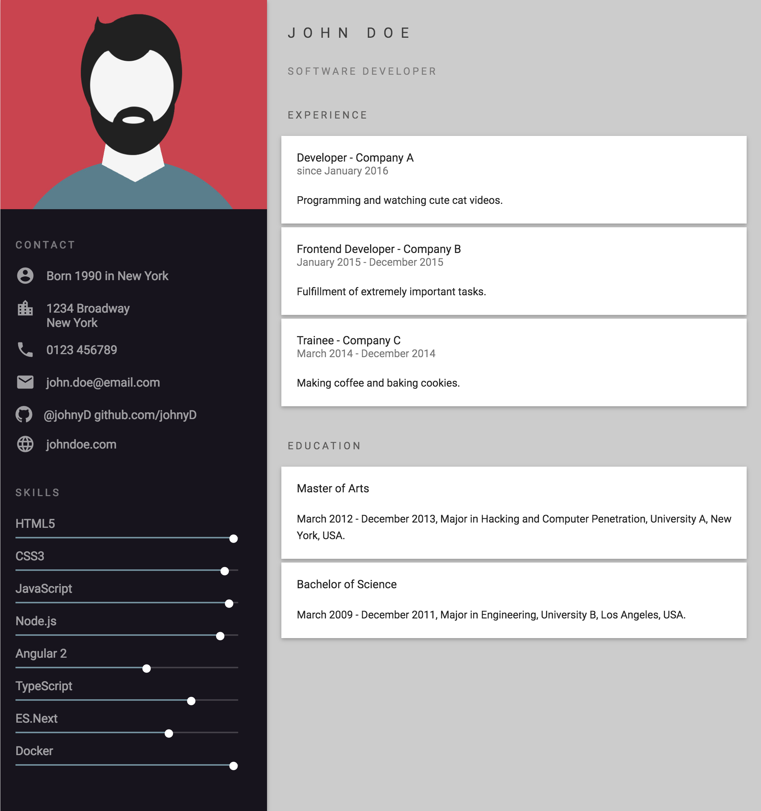
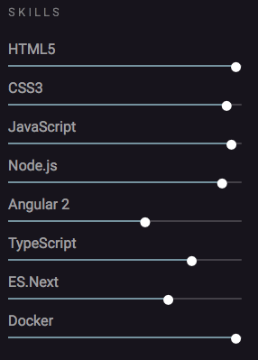
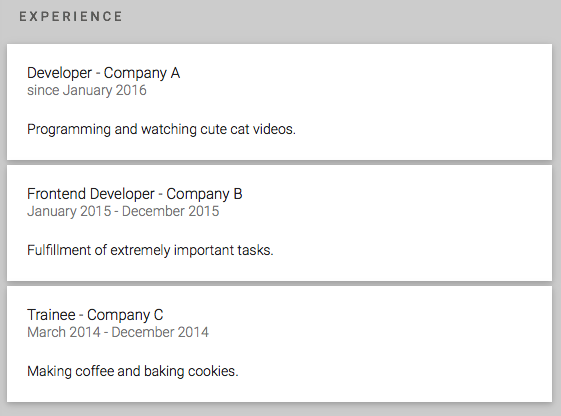
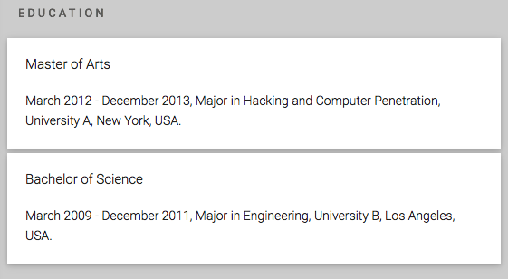

# Curriculum vitae

## DESCRIÇÃO
---

A revista Exame recentemente constatou uma realidade no mercado de trabalho, informando que a "[demanda cresce por profissionais de TI durante a crise](https://exame.abril.com.br/carreira/demanda-cresce-por-profissionais-de-ti-durante-a-crise/)". Na prática, mesmo com esse cenário de problemas econômicos, é possível ver que o aumento constante de tecnologia justifica em parte a existência desses profissionais para desenvolver e manter as soluções digitais.

Para as empresas os benefícios do investimento nesses profissionais geralmente são revertidos rapidamente em aumento do faturamento e lucro. 

Para concorrer a uma dessas vagas geralmente o candidato deve passar por um processo de recrutamento realizado por Headhunters, que, guiado pelas demandas de empresas, avalia candidatos sob várias óticas para selecionar um possível perfil.

Uma dessas etapas, geralmente, consiste na análise de perfil para identificar as habilidades e o histórico do profissional.

Então, pensando em facilitar o processo nessa etapa, um Headhunter da Empresa X idealizou a criação do currículo semelhante ao da *Figura 1* para filtrar seus candidatos, pois esse currículo aborda as principais informações que ele deseja na análise curricular.

*Figura 1 - Layout do Curriculum*



A seguir, será detalhado a estrutura e estilo das quatro **INFORMAÇÕES** a serem declarados por um possível candidato, no entanto, o Headhunter informa que das 4 apenas 3 já seriam suficientes para a vaga, desde que inclua o contato e as skills.

Para acelerar a submissão do currículo o Headhunter já disponibilizou boa parte do HTML, CSS, fontes e imagens no arquivo [code.zip](code.zip).

## INFORMAÇÕES
---

**INFORMAÇÃO 1 -** Crie a região contento informações de contato no arquivo [`code/index.html`](code/index.html), especificamente em `TODO INFORMAÇÃO 1`, conforme a *Figura 2*:

*Figura 2 - Informações de Contato.* <br>


mas considerando que:

* Os dados de contato que forem relacionados a link, como a URL do perfil do github, devem estar como um hyperlink.
* Em [`code/css/contact.css`](code/css/contact.css) cada contato deve haver um distanciamento vertical entre si, e os ícones e os dados devem apresentar distribuição o mais próximo possível da *Figura 2*.

**INFORMAÇÃO 2 -** Crie a região contento informações sobre as skills no arquivo [`code/index.html`](code/index.html), especificamente em `TODO INFORMAÇÃO 2`, conforme a *Figura 3*:

*Figura 3 - Informações sobre as Skills.* <br>


mas considerando que:

* Cada progresso de skill deve ser estruturado conforme o seguinte HTML:

```
<div class="skill">
  <span>HTML5</span>
  <div class="progress">
    <div class="determinate" style="width: 99%;">
      <i class="fa fa-circle"></i>
    </div>
  </div>
</div>
```

* Em [`code/css/skill.css`](code/css/skill.css) as tags `.progress` devem possuir um background de `hsla(0, 0%, 100%, .19)`, e margem de `.5rem 0 10px`.
* Cada `.skill` deve possuir uma margem esquerda de `20px`, um recuo interno superior de `4px`, e largura de `93%`.

**INFORMAÇÃO 3 -** Crie a região contento informações sobre as experiências profissionais no arquivo [`code/index.html`](code/index.html), especificamente em `TODO INFORMAÇÃO 3`, conforme a *Figura 4*:

*Figura 4 - Informações sobre as Experiências Profissionais.* <br>


mas considerando que:

* Em [`code/css/block.css`](code/css/block.css) os blocos de informação devem possuir uma largura de `90%`, cor de plano branco, recuo interno de `20px`, margem de `5px auto`, e sombra de borda com o seguinte valor `0 2px 5px 0 rgba(0, 0, 0, .16), 0 2px 10px 0 rgba(0, 0, 0, .12)`.
* O título da experiência deve conter a cor `rgba(0, 0, 0, .87)`, o tamanho de `15px` e negrito de `300`.
* O período da experiência deve conter a cor `rgba(0, 0, 0, .54)`, o tamanho de `14px` e o negrito de `300`.
* A descrição da experiência deve conter o tamanho de `14px`, a cor `rgba(0, 0, 0, .87)`, e o distanciamento superior de 20px.

**INFORMAÇÃO 4 -** Crie a região contento informações sobre a formação profissional no arquivo [`code/index.html`](code/index.html), especificamente em `TODO INFORMAÇÃO 4`, conforme a *Figura 5*:

*Figura 5 - Informações sobre a Formação Profissional.* <br>


mas considerando que o mesmo estilo aplicado nos blocos da Informação 3 devem ser habilitados nesta informação.

> [Alternativa de resposta](code-response/).
