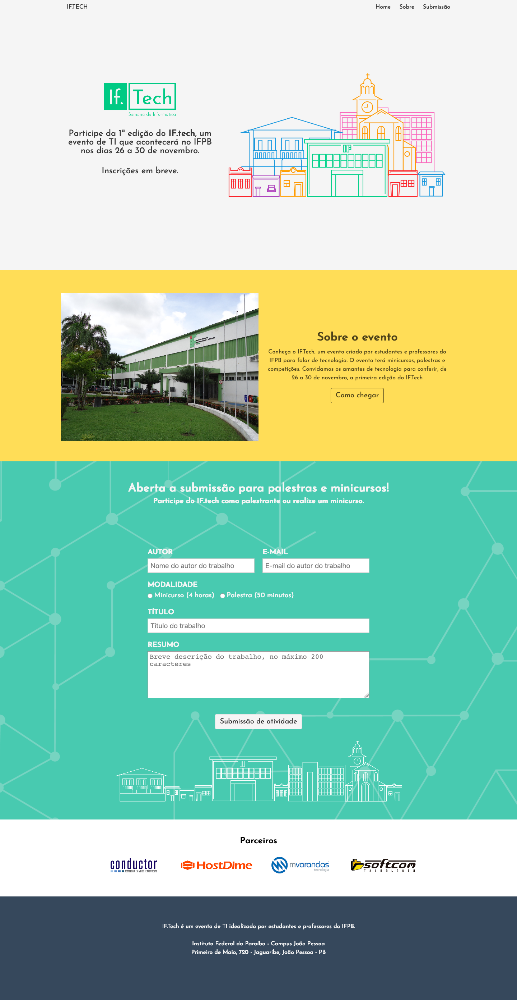
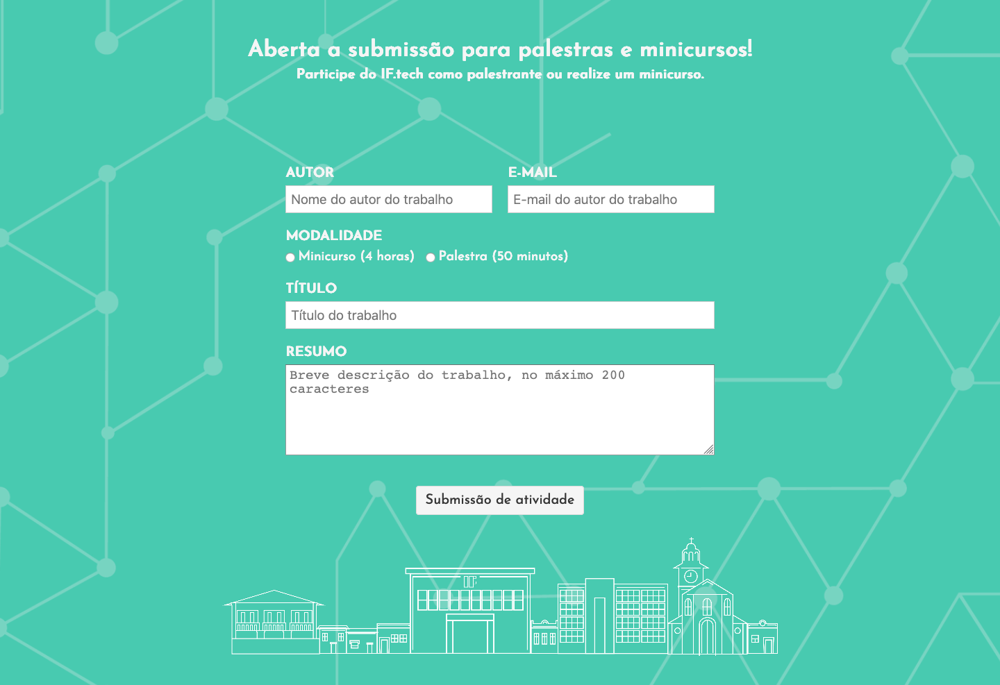

# Desafio IF.tech

## Descrição
---

Os professores do IFPB precisam de alguns ajustes no site de divulgação pré-evento do IF.tech para alcançar a aparência da Figura 1.

*Figura 1 - Layout do site no Desktop* 

Esta estrutura básica se encontra no arquivo [site.zip](site.zip) e a ideia do desafio consiste em fazer o ajuste nos dois componentes a seguir.

## Componentes
---

**COMPONENTE 1 -** Crie a animação de carremento do site através do banner para que seja conforme a Figura 2.

*Figura 2 - Animação do Banner Principal (No Google Chrome você deve acionar o play)* 
<video autoplay loop controls>
  <source src="assets/banner.mp4" type="video/mp4">
</video>

Lembrando que as mudanças de propriedades necessárias para este efeito devem ocorrer:

- Nos elementos `.navbar` e `#home` (Com intervalo de `2.5s` e velocidade `ease-in-out`):

| Tempo (%) | Cor de plano de fundo |
|-|-|
| 0 | `#bbb` |
| 100 | `#f5f5f5` |

- No `.container` do `.navbar` (Com tempo de animação de `2s`):

| Tempo (%) | Transparência |
|-|-|
| 0 | total |
| 80 | total |
| 100 | nula |

- Na descrição do banner (Com tempo de animação de `2s`):

| Tempo (%) | Posição | Transparência |
|-|-|-|
| 0 | 100px a esquerda | total |
| 30 | - | total |
| 80 | - | nula |
| 100 | posição original | - |

- Na imagem do banner (Com tempo de animação de `2.5s`):

| Tempo (%) | Posição | Transparência |
|-|-|-|
| 0 | 100px a direita | total |
| 30 | - | total |
| 80 | - | nula |
| 100 | posição original | - |

Além disso, quando o curso estiver sobre os itens da barra de menu deve haver uma transição de `.3s` para a cor de plano de fundo branca, tal como a Figura 3.

*Figura 3 - Animação na barra de menu (No Google Chrome você deve acionar o play)* 
<video autoplay loop controls>
  <source src="assets/navbar.mp4" type="video/mp4">
</video>

**COMPONENTE 2 -**  A submissão de atividades substituirá o Google Form por um formulário na própria página segundo os campos e aparência da Figura 4.

*Figura 4 - Formulário de inscrição.* 

Então construa o formulário preservando a aparência proposta.

 
 

> [Alternativa de resposta](site-response/)