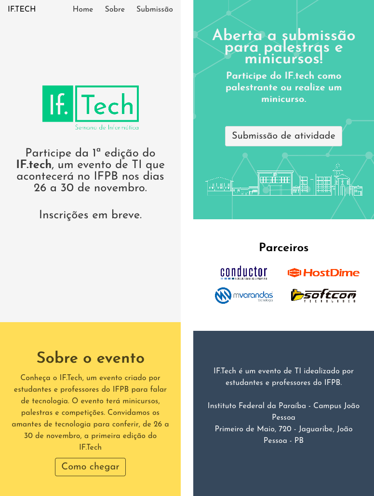
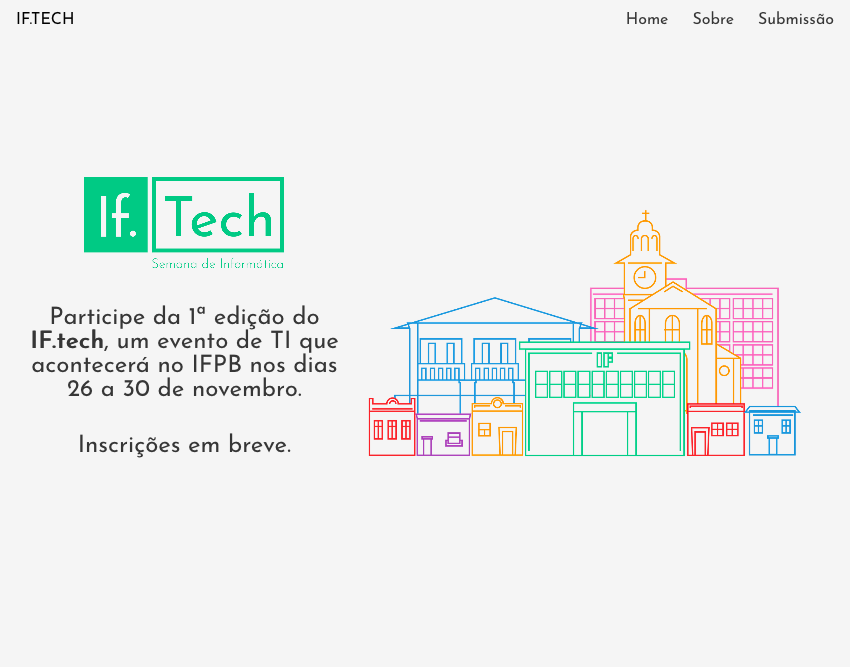
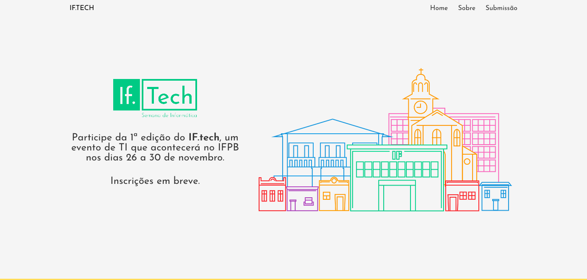

# Desafio IF.tech

## Descrição
---

Os professores do IFPB precisam de ajuda na refatoramento do site de divulgação do IF.tech pré-evento, conforme é possível ver no repositório [ifpb/iftechx](https://github.com/ifpb/iftech) ele foi modelo usando uma biblioteca CSS chamada [Bulma CSS](https://bulma.io) e a ideia seria remove-lo do projeto.

Para auxiliar o desenvolvido foi proposto um desafio que exige a criação de alguns componentes visuais, que serão descritos a seguir usando o layout Mobile First da Figura 1.

*Figura 1 - Layout do site em 375px* 

Esta estrutura básica se encontra no arquivo [site.zip](site.zip), e a ideia do desafio consiste em fazer no mínimo 2 componentes responsivos para resolução superiores, contudo, o componente 3 é obrigatório.

Os breakpoints necessários para cada componente serão descritos e ilustrados a seguir.

## Componentes
---

**COMPONENTE 1 -** Crie a responsividade do banner do site, contudo, considere que essa região possui três breakpoints em 375px, 850px e 1100px, respectivamente ilustrado na Figura 2(a), Figura 2(b) e Figura 2(c). Observação, o breakpoint de 1100px limita a expansão da seção definindo uma largura fixa de 1100px, e a Figura 2 (c) está sendo exibido a 1400px.

*Figura 2 - Cabeçalho* 
*(a) 375px* 
 
*(b) 850px* 
 
*(c) 1100px* 
 

**COMPONENTE 2 -** Crie a responsividade da seção sobre, contudo, considere que essa região possui três breakpoints em 375px, 800px e 1100px, respectivamente ilustrado na Figura 3(a), Figura 3(b) e Figura 3(c). Observação, o breakpoint de 1100px limita a expansão da seção definindo uma largura fixa de 1100px, e a Figura 3 (c) está sendo exibido a 1400px.

*Figura 3 - Seção sobre* 
*(a) 375px* 
 
*(b) 800px* 
 
*(c) 1100px* 
 

**COMPONENTE 3 -** Crie a responsividade da seção parceiros, contudo, considere que essa região possui três breakpoints em 375px, 550px e 1100px, respectivamente ilustrado na Figura 4(a), Figura 4(b) e Figura 4(c). Observação, o breakpoint de 1100px limita a expansão da seção definindo uma largura fixa de 1100px, e a Figura 4 (c) está sendo exibido a 1400px.

*Figura 4 - Seção parceiros* 
*(a) 375px* 
 
*(b) 550px* 
 
*(c) 1100px* 
 

 
 

> [Alternativa de resposta](site-response/)