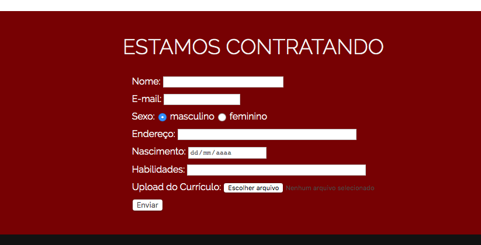

# Desafio Industrious - Animação

## Descrição
---

A estrutura básica do site se encontra no arquivo [site.zip](site.zip), e é exigida a criação dos 2 (dois) componentes.

## Componentes
---

**COMPONENTE 1 -** Crie a animação de carregamento do site conforme o vídeo 1.

*Vídeo 1 - Animação Banner Principal (No Google Chrome você deve acionar o play)* 
<video width="100%" height="100%" autoplay loop controls>
  <source src="assets/anime1.mp4" type="video/mp4">
</video>

No arquivo `css/main.css` adicione as modificações em `/* TODO ANIMAÇÃO */`. Observe que a primeira linha (INDUSTRIOUS) leva 2 segundos para caminhar da `direita para a esquerda`. A segunda linha caminha, no mesmo tempo, da `esquerda para a direita` e a terceira linha da `direita para a esquerda`.

*Vídeo 2 - Animação das imagens dos `Testimonials` (No Google Chrome você deve acionar o play)* 
<video width="100%" height="100%" autoplay loop controls>
  <source src="assets/anime2.mp4" type="video/mp4">
</video>

No arquivo `css/main.css` adicione as modificações em `/* TODO ANIMAÇÃO */`. Observe que ao passar o mouse por cima das imagens, elas aumentam o seu tamanho original em `20%` e voltam ao tamanho original ao final da animação. O tempo total da animação é de `1s`.

**COMPONENTE 2 -** Crie um formulário conforme a Figura 1.

No arquivo `index.html`, insira o formulário em `<!-- TODO FORMULÁRIO -->`. No arquivo `css/main.css`, faça as alterações em `/* TODO FORMULÁRIO */`.

*Figura 1 - Formulário* 

No CSS, respeite as seguintes configurações:

* Toda a área do formulário tem cor de fundo igual a `#820202`, padding de `2%` e cor da fonte igual a `whitesmoke`
* O botão ENVIAR tem tamanho da fonte de `15px`
* O `input` do campo nome tem largura de `200px`
* O `input` do campo endereco tem largura de `300px`
* O `input` do campo habilidades tem largura de `300px`

> [Alternativa de resposta](site-response/)