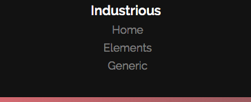
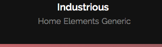
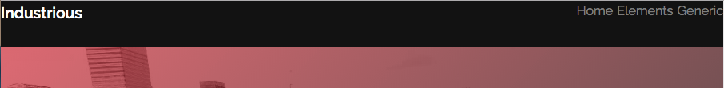
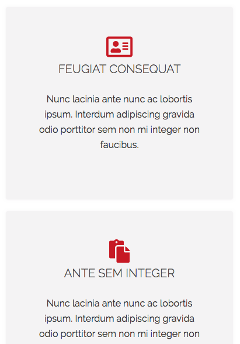
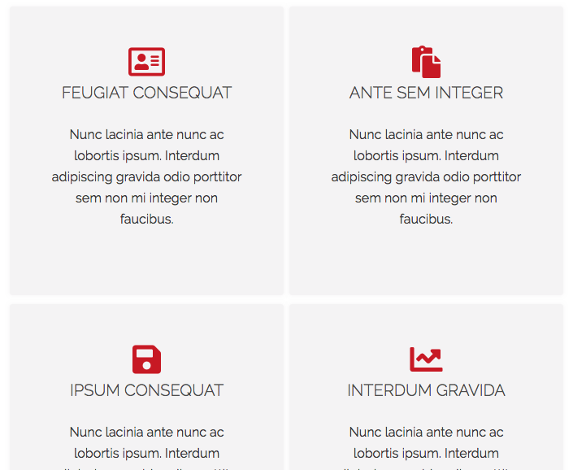
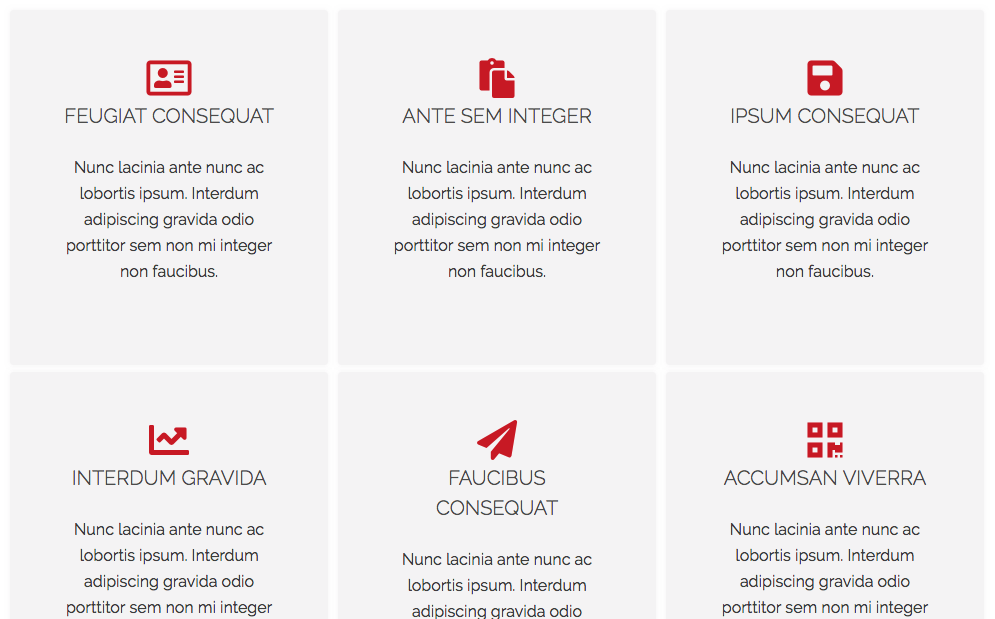
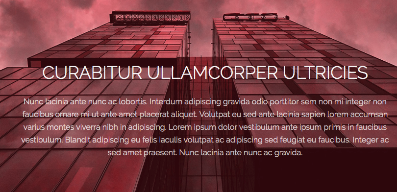

# Desafio Industrious

## Descrição
---

A estrutura básica do site se encontra no arquivo [site.zip](site.zip), e é exigida a criação de todos os 3 (três) componentes.

## Componentes
---

**COMPONENTE 1 -** Crie a responsividade do cabeçalho do site. Considere que essa região possui três breakpoints em 300px, 600px e 900px, respectivamente ilustrado na Figura 1(a), Figura 1(b) e Figura 1(c).

No arquivo `css/main.css`, faça as alterações em `/* TODO - COMPONENTE 1 */`. Para esse componente use `flex`.

*Figura 1 - Barra de menu* 
*(a) 300px* 

*(b) 600px* 

*(c) 900px* 

**COMPONENTE 2 -** Crie a responsividade da seção de `highlights`. Considere que essa região possui três breakpoints em 300px, 600px e 900px, respectivamente ilustrado na Figura 2(a), Figura 2(b) e Figura 2(c).

No arquivo `css/main.css`, faça as alterações em `/* TODO - COMPONENTE 2 */`. Para esse componente use `grid`.

Estilizar o espaçamento do grid com `1%`.

*Figura 2 - Highlights* 
*(a) 300px* 

*(b) 600px* 

*(c) 900px* 

**COMPONENTE 3 -** Estilizar o Background na seção `CTA`, de acordo com a Figura 3.

*Figura 3 - Background CTA* 

No arquivo `css/main.css`, especificamente em `/* TODO - COMPONENTE 3 */`, faça as seguintes alterações:

* A cor de background deve ser igual a `#ce1b28`;

* Usar como imagem a função de gradiente indo de `rgba(206, 27, 40, 0.25)` a `rgba(206, 27, 40, 0.25)` em conjunto com a imagem `cta01.jpg`;

* O background é `fixo`, `não se repete` e cresce até cobrir toda a área disponível, ou seja, `cresce até atingir tanto a largura como altura disponível`.

* Posicionar o background em `bottom`.

> [Alternativa de resposta](site-response/)
