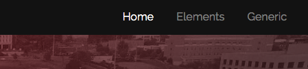
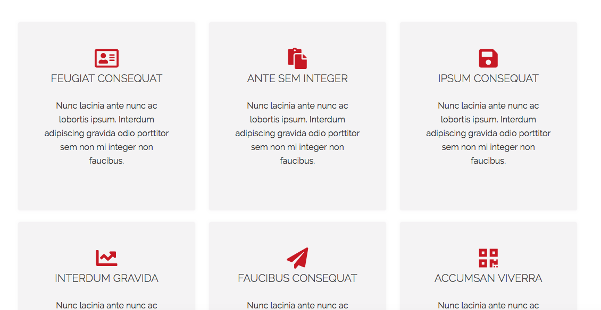
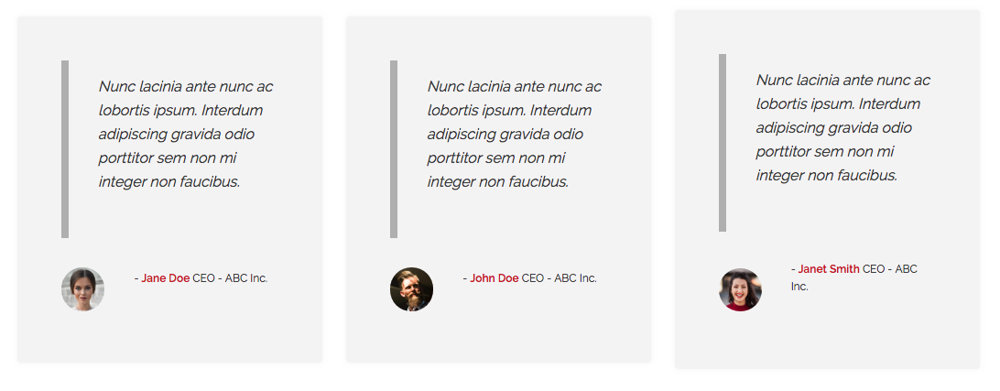
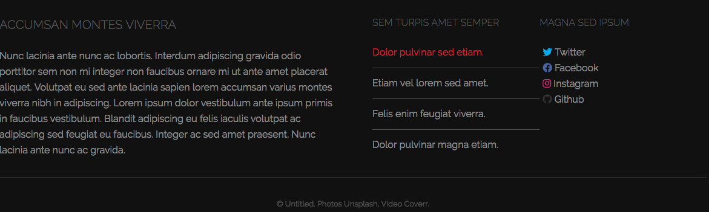

# Desafio Industrious

## Descrição
---

A estrutura básica do site se encontra no arquivo [site.zip](site.zip), e é exigida a criação de no mínimo 3 (três) componentes.

## Componentes
---

**COMPONENTE 1 -** Altere características gerais para toda a página.

No arquivo `css/main.css`, especificamente em `/* TODO - COMPONENTE 1 */`, faça as seguintes alterações:

* A cor de background de toda a página deve ser igual a `#ffffff`;

* Margens iguais a `0` (zero) e recuos internos de `0` (zero);

* Fonte de toda a página igual a `Raleway`. Caso a `Raleway` não esteja presente: `Arial, Helvetica e sans-serif`;

* Não esquecer de adicionar ao arquivo `index.html` a url da fonte do [Google Fonts](https://fonts.google.com/), com os valores de peso `200`, `300`, `400`, `500` e `600`.

* Usar peso da fonte de `400` e tamanho de `1rem`;

**COMPONENTE 2 -** Crie a barra de menu conforme ilustra a *Figura 1*: 

*Figura 2 - Barra de menu*<br>


Contudo, considere os seguintes itens:

* No arquivo `index.html`, especificamente em `<!-- TODO Barra de menu -->` dentro do elemento `<nav>`, crie a lista de itens do menu usando a estrutura:

  ```html
  <ul>
    <li><a href="#">Texto 1</a></li>
    ...
    <li><a href="#">Texto N</a></li>
  </ul>
  ```

* No arquivo `css/main.css`, especificamente em `/* TODO - COMPONENTE 2 */`, faça com que o menu (`<nav>`) tenha altura de `3.25em`, altura da linha de `3.25rem`, recuo vertical de `0` e horizontal de `1.25rem`.

* Os links em `<nav>` devem ter cor `rgba(255, 255, 255, 0.5)`, recuo vertical `0` e horizontal `0.75rem`.

* Quando o mouse estiver sobre os elementos do menu, a cor deve mudar para `branca`.

**COMPONENTE 3 -** Estilize a área de highlights conforme ilustra a *Figura 2*:

*Figura 2 - Highlights*<br>


No arquivo `css/main.css`, especificamente em `/* TODO - COMPONENTE 3 */`, faça:

* As seções no `highlights` devem ter largura de `30%` e margem de `1%`.

* Observação: Por padrão, cada um dos `highlights` (tag `<section>`) possui display de bloco.

* Não esquecer de adicionar ao arquivo `index.html` a url do [Font Awesome](https://fontawesome.com).

* Os ícones das tags `<i>` na área `<!-- TODO - Highlights -->` utilizados são:

  ```
  far fa-address-card
  fas fa-paste
  fas fa-save
  fas fa-chart-line
  fas fa-paper-plane
  fas fa-qrcode
  ```
* Os ícones devem ter tamanho de `2.5em`.

**COMPONENTE 4 -** Estilize a lista de Testemunhos conforme ilustra a *Figura 3*:

*Figura 3 - Testemunhos*<br>


Contudo, considere os seguintes itens:

* Em `<!-- TODO - Testimonials -->`, no arquivo `index.html`, cada testemunho (3 no total) deve apresentar a estrutura HTML a seguir:

```
<section>
	<div class="content">
		<blockquote>
			<p>Nunc lacinia ante nunc ac lobortis ipsum. Interdum adipiscing gravida odio porttitor sem non mi integer non faucibus.</p>
		</blockquote>
		<div class="author">
			<div class="image">
				
			</div>
			<p class="credit">- <strong>NOME</strong> <span>TRABALHO</span></p>
		</div>
	</div>
</section>
```
Os dados a serem preenchichos são:

<table>
  <tr>
    <th>IMAGEM</th>
    <th>NOME</th>
    <th>TRABALHO</th>
  </tr>
  <tr>
    <td>pic01.jpg</td>
    <td>Jane Doe</td>
    <td>CEO - ABC Inc.</td>
  </tr>
  <tr>
    <td>pic02.jpg</td>
    <td>Jonh Doe</td>
    <td>CEO - ABC Inc.</td>
  </tr>
  <tr>
    <td>pic03.jpg</td>
    <td>Janet Smith</td>
    <td>CEO - ABC Inc.</td>
  </tr>    
</table>

* No arquivo `css/master.css`, em `/* TODO - COMPONENTE 4 */`, a área com o texto do testemunho (`blockquote`), deve possuir borda esquerda sólida com `0.5rem`. Cor da borda esquerda `rgba(0, 0, 0, 0.25)` e fonte em itálico.

* As imagens das pessoas devem ser redondas e com largura de `100%`.

**COMPONENTE 5 -** Estilize o rodapé da página conforme ilustra a *Figura 4*:

*Figura 4 - Rodapé*<br>


Contudo em `<!-- TODO - COMPONENTE 5 -->` no arquivo `css/main.css`, altere as seguintes informações:

* Os links do `#footer` devem ter cor `rgba(255, 255, 255, 0.5)` e as bolinhas (&#9679;) devem ser removidas dos itens da lista.

* Quando o mouse estiver sobre os links do `#footer`, a cor apresentada dever ser `#ce1b28`.

* Se o componente 3 não foi respondido, adicionar ao arquivo `index.html` a url do [Font Awesome](https://fontawesome.com).

* Os ícones devem possuir cores conforme o especificado abaixo:

| Ícones | Cores |
|-|-|
| twitter | `#00abf1` |
| facebook | `#4b64a6` |
| instagram | `#dd2a7b` |
| github | `#333333` |

> [Alternativa de resposta](site-response/)