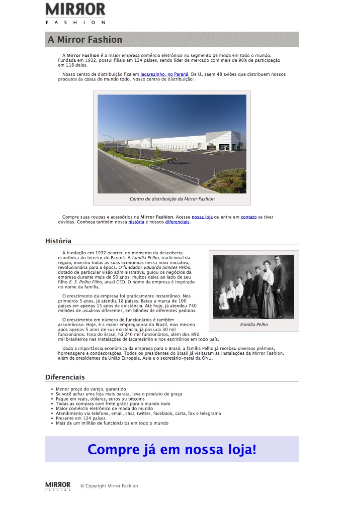

# Mirror Fashion

## DESCRIÇÃO
---

A ideia desse desafio consiste em desenvolver a página sobre do Mirror Fashion detalhada nos exercícios [deste capítulo](https://www.caelum.com.br/apostila-html-css-javascript/introducao-a-html-e-css/#exerccios-listas-e-margens) da apostila do Caelum sobre Desenvolvimento Web com HTML, CSS e JavaScript. O resultado final pode ser visto na *Figura 1*:

*Figura 1 - Página sobre do Mirror Fashion*

> *[Alternativa de resposta](code-response/sobre.html)*