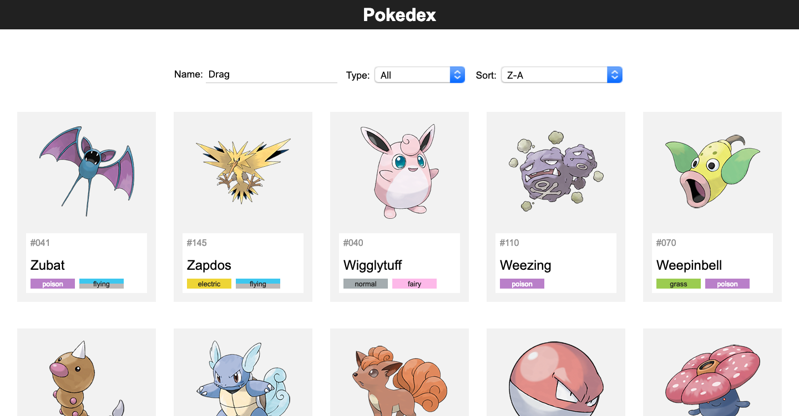
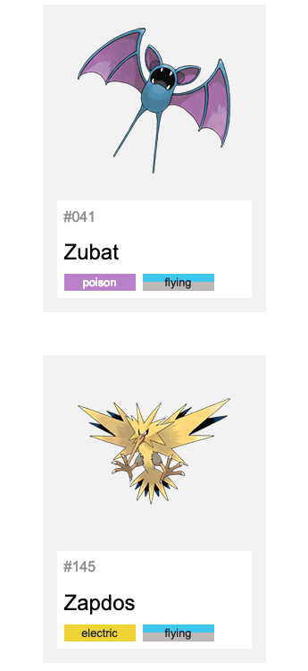
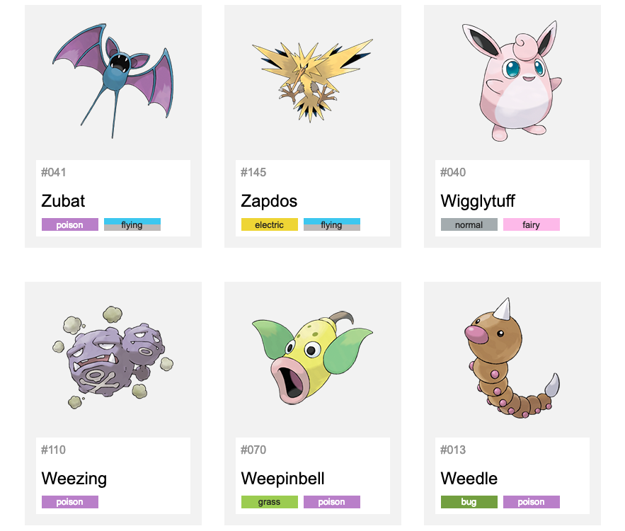
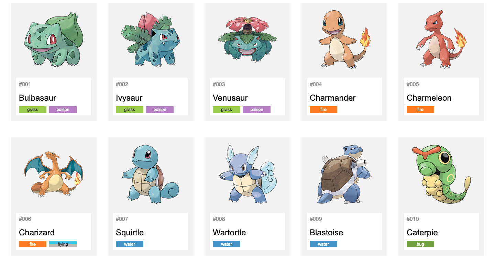
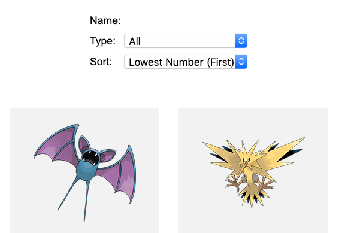
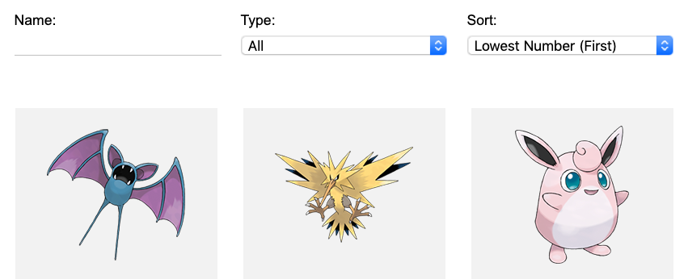
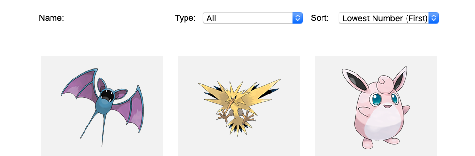

# Pokedex Challenge

## Descrição
---

Uma empresa de artigos Nerd está em busca de profissionais para criar um página Web sobre a Pokedex de Pokemons que possua a estrutura semelhante ao da Figura 1.

*Figura 1 - Layout da Página* 

Detalhe, a empresa já disponibilizou uma estrutura inicial no arquivo [code.zip](code.zip), e a seguir serão descritos alguns componentes para auxiliar a geração da página.

## Componentes
---

**COMPONENTE 1 -** Crie a responsividade do banner do site, contudo, considere que essa região possui alguns breakpoints que irão contemplastr o agrupamento de 1 até 5 cards no Pokedex. As visualizações das Figuras 2(a), Figura 2(b) e Figura 2(c) exibem respectivamente os agrupamentos de 1, 3 e 5.

*Figura 2 - Grid do Pokedex.* 

*(a) Agrupado a cada 1 card* 

*(b) Agrupado a cada 3 card* 

*(c) Agrupado a cada 5 cardx* 

**COMPONENTE 2 -** Crie a responsividade do banner do site, contudo, considere que essa região possui dois breakpoints em 840px e 980px, o que gera as visualizações das Figuras 2(a), Figura 2(b) e Figura 2(c).

*Figura 3 - Barra de filtro.* 

*(a) Até 840px* 

*(b) Entre 840px e 980px* 

*(c) Superior à 980px* 

Os elementos do campo de filtro de tipo são: `All`, `bug`, `dragon`, `electric`, `fairy` e `fighting`. Enquanto que os campos de ordenção são: `Lowest Number (First)`, `Highest Number (First)`, `A-Z` e `Z-A`.

**COMPONENTE 3 -** Crie a animação de carremento do site durante um intervalo de tempo de `2s` conforme a Figura 2, que supende a opacidade total do `<main>` até 80% do tempo.

*Figura 4 - Animação inicial da página (No Google Chrome você deve acionar o play).* 

<video autoplay loop controls style="width: 100%">
  <source src="assets/component-3.mp4" type="video/mp4">
</video>

**COMPONENTE 4 -** Crie algumas animações de interatividade nos cards `pokemon` para o evento `:hover` e `:focus`, respectivamente ilustrado na Figura 5(a) e na Figura 5(b).

*Figura 5 - Animações no Card do Pokemon.* 
*(a) Animação disparada com o :hover em `.pokemeon`* 

<video autoplay loop controls>
  <source src="assets/component-4.1.mp4" type="video/mp4">
</video>

*(b) Animação disparada com o :focus em `.pokemeon`* 

<video autoplay loop controls>
  <source src="assets/component-4.2.mp4" type="video/mp4">
</video>

 
 
 

> [Alternativa de resposta](code-response/)