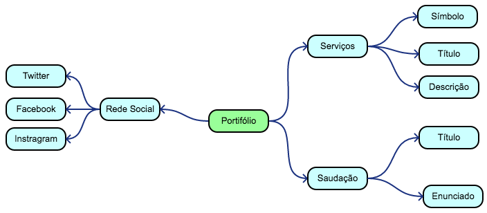
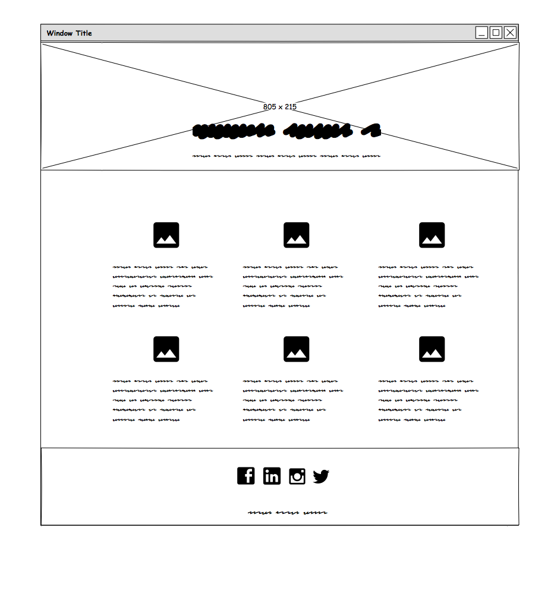
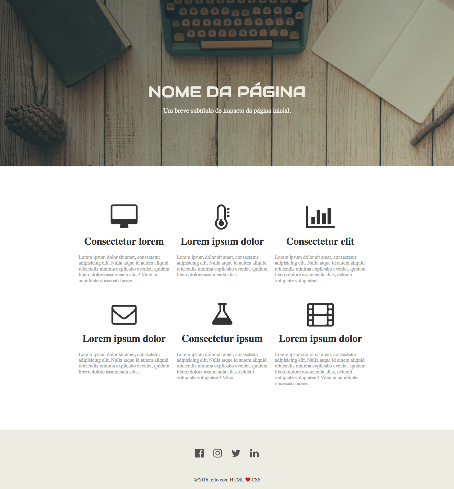

# Portifólio com Layout

## Descrição
---

Na seleção de uma empresa, uma das etapas de contratação consiste na elaboração de um portfólio para empresa. 

Toda a ideia da apresentação e conteúdo do portfólio foi elaborada segundo o mapa mental da *Figura 1*.

*Figura 1* - Mapa mental do Portfólio


Com a ajuda do Design da empresa foi elaborado um possível protótipo de baixa fidelidade seguindo as informações do mapa mental, e o resultado foi o presente na *Figura 2*

*Figura 2* - Esboço do Portfólio


Com isso, o Design projetou uma proposta de interface para desktop cujo o resultado está presente na *Figura 3*.

*Figura 3* - Interface do Portfólio<br>


Então a empresa espera que você crie este portifólio, contudo, para facilitar o processo de seleção já foi fornecido textualmente algumas informações que estão disponíveis no arquivo [code.zip](code.zip).

**Obs.:** Os arquivos e diretórios do site apresentam a estrutura a seguir:

```
site
├── css
│   └── master.css
├── font
│   └── Lora-Regular.ttf
├── img
│   └── desk.jpg
└── index.html
```

> [Alternativa de resposta](site-response/).