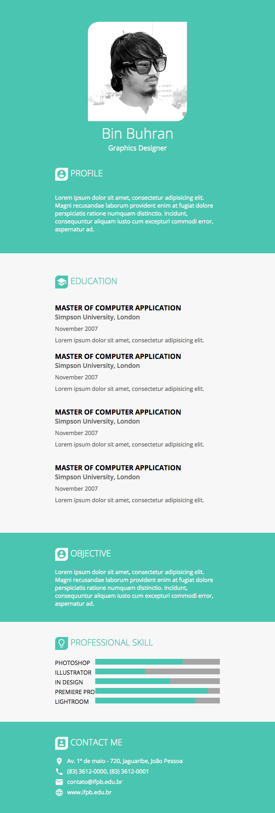
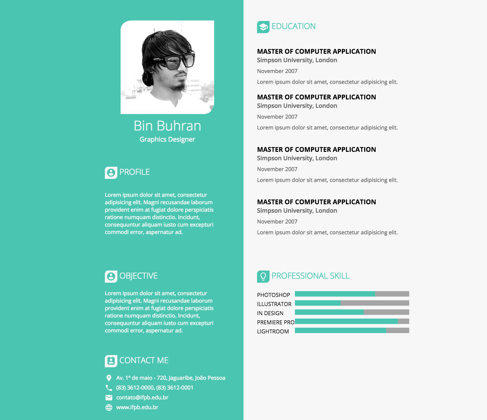

# Profile Responsive

## DESCRIÇÃO
---

Devido ao sucesso da primeira etapa, a empresa [B2W Marketplace](https://github.com/b2w-marketplace/code-challenge) está selecionando novas pessoas para a vaga de Frontend. A segunda etapa da seleção consiste em tornar a página Web da *Figura 1*, que já é Mobile First, em uma página responsiva.

Para acelerar o desenvolvimento o Headhunter já disponibilizou boa parte do HTML, CSS, fontes e imagens no arquivo [code.zip](code.zip).

*Figura 1 - Layout da página em 320px*  

A seguir o Headhunter da empresa irá detalhar os critérios da seleção dessa etapa. No total existem 5 **COMPONENTES** a serem desenvolvidos, no entanto, o candidato deverá resolver apenas 3 deles, sendo uma obrigatória (COMPONENTE 5) e escolher outras duas. A descrição de cada componente estão detalhados mais adiante.

## COMPONENTES
---

**COMPONENTE 1 -** Crie o layout das informações de contato segundo a ilustração da **Figura 1**.

**COMPONENTE 2 -** Crie o layout das informações de formação, segundo a ilustração da **Figura 1**, de modo que a data fique posicionada corretamente sem alterar o HTML.

**COMPONENTE 3 -** Crie o layout das informações de skill, segundo a ilustração da **Figura 1**.

**COMPONENTE 4 -** Faça com que a página possua a aparência da **Figura 2**, quando o navagedor possui largura entre 700px e 1000px.

*Figura 2 - Layout da página em 768px*  

**COMPONENTE 5 -** Faça com que a página possua a aparência da **Figura 3**, quando o navagedor possui largura superior à 1000px.

*Figura 3 - Layout da página em 1440px*  

> [Alternativa de resposta](code-response/).