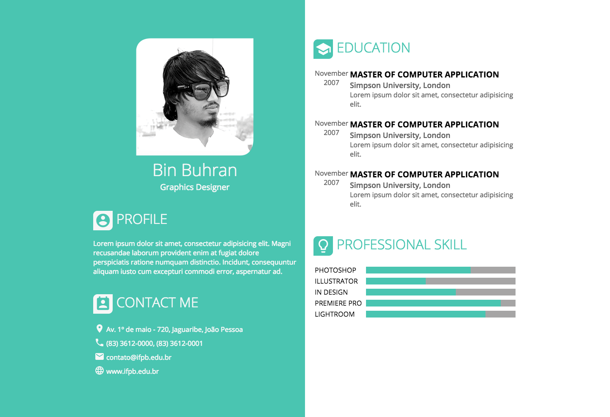
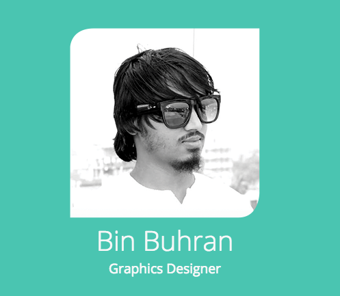
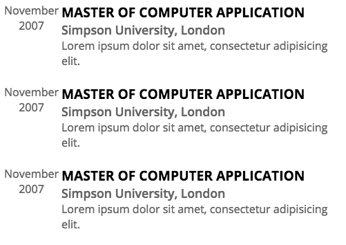
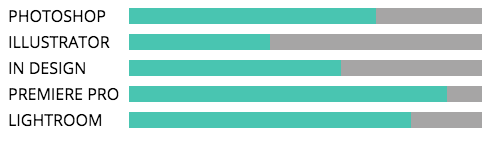

# Profile

## DESCRIÇÃO
---

A empresa [B2W Marketplace](https://github.com/b2w-marketplace/code-challenge) está selecionando pessoas para a vaga de Frontend. A primeira etapa da seleção consiste em desenvolver uma página Web semelhante à *Figura 1*.

*Figura 1 - Layout da página*

A seguir o Headhunter da empresa irá detalhar os critérios da seleção dessa etapa. No total existem 4 **componentes** a serem desenvolvidos, no entanto, o candidato deverá escolher apenas 3 deles. A descrição de cada componente será detalhada na próxima seção.

Para acelerar o desenvolvimento o Headhunter já disponibilizou boa parte do HTML, CSS, fontes e imagens neste arquivo [code.zip](code.zip).

## COMPONENTES
---

**COMPONENTE 1 -** Crie o componente ilustrado na *Figura 2* considerando que:

* A `
` de class `cover` possua uma largura de `278px`, margem superior e inferior de `40px`, margens laterais distribuídas de forma automática, e texto centralizado;
* A imagem `person.png` fique dentro da região de class `cover`;
* Os títulos `Bin Buhran` e `Graphics Designer` fiquem dentro da `
` de class `cover`, respectivamente sendo de primeiro e segundo nível. Para o primeiro nível o tamanho da fonte seria de `2.5em` e negrito de `300`. Já para o segundo nível adote o tamanho de fonte de `1.2em` com negrito de `400`;

*Figura 2 - Layout do componente 1*  

**COMPONENTE 2 -** Crie o componente ilustrado na *Figura 3* considerando que:

* Uma tabela cuja a primeira coluna contém alguns [material icons](https://material.io/icons/). Detalhe, os nomes dos ícones se encontram no HTML;
* O Hyperlink `www.ifpb.edu.br` presente na tabela deve possuir a cor de texto de `#f7f7f7` e não estar sublinhado, exceto sob o curso do mouse;

*Figura 3 - Layout do componente 2*  

**COMPONENTE 3 -** Crie o componente ilustrado na *Figura 4* considerando que:

* As células da tabela na `
` de classe `education` devem possuir alinhamento vertical ao topo (`vertical-align: top;`) e recúo interno inferior de `20px`;

* A classe `date` dentro da tabela na `
` de classe `education` deve possuir a cor de texto de `#636363` e alinhamento centralizado;

* Os `<h1>` dentro da tabela na `
` de classe `education` devem possuir tamanho de fonte de `1.2em`, negrito de 700 e texto maiúsculo;

* Os `<h2>` dentro da tabela na `
` de classe `education` devem possuir tamanho de fonte de `1.1em`, negrito de 600 e cor de texto de `#636363`;

* Os `
` dentro da tabela na `
` de classe `education` devem possuir cor de texto de `#636363`.

*Figura 4 - Layout do componente 3*  

**COMPONENTE 4 -** Crie o componente ilustrado na *Figura 5* considerando que:

* A tabela dentro da `
` que contém a `skill`, deve possuir a largura de `100%`, entretanto a primeira coluna com largura de 25% e texto maiúsculo;

* A div de classe `skill-bar` deve possuir cor de plano de fundo de `#a6a5a5`;

* A div de classe `skill-value` deve possuir cor de plano de fundo de `#49c5b1` e tamanho de `1em`.

*Figura 5 - Layout do componente 4*  

> *[Alternativa de resposta](code-response/).*
