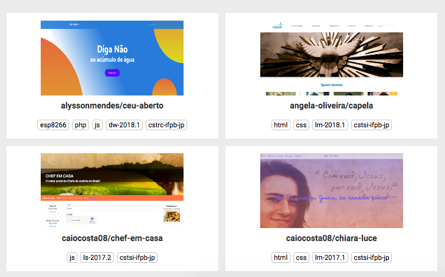
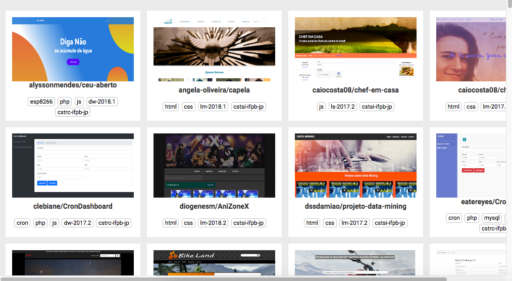
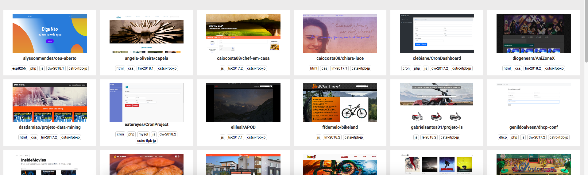
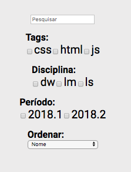
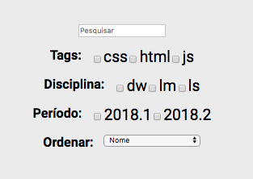

# Projetos LM Challenge

## Descrição
---

Prova Final da disciplinas de Linguagens de Marcação. Para a avaliação da prova, todos os componentes devem ser resolvidos.

O código da prova está disponível no arquivo [site.zip](site.zip), e a seguir serão descritos os componentes.

## Componentes
---

**COMPONENTE 1 -** Crie a responsividade dos projetos do site, contudo, considere que essa região possui alguns breakpoints em `700px`, `1000px` e `1300px` que irão contemplar o agrupamento de 2, 4 e 6 cards de Projetos. As visualizações das Figuras 1(a), Figura 1(b) e Figura 1(c) exibem respectivamente os agrupamentos de 2, 4 e 6 cards.

*Figura 1 - Grid dos Projetos.* 

*(a) Agrupado a cada 2 cards* 

*(b) Agrupado a cada 4 cards* 

*(c) Agrupado a cada 6 cards* 

**COMPONENTE 2 -** Crie a responsividade do banner de filtros, contudo, considere que essa região possui dois breakpoints em `800px` e `1200px`, o que gera as visualizações das Figuras 2(a) e Figura 2(b).

*Figura 2 - Barra de filtros.* 

*(a) Entre 800px e 1200px* 

*(b) Acima de 1200px* 

**COMPONENTE 3 -** Crie a animação de carremento do site durante um intervalo de tempo de `3s`, sendo as palavras possuindo deslocamento de `200px`, conforme o Vídeo 1.

*Vídeo 1 - Animação inicial da página (No Google Chrome você deve acionar o play).* 

<video width="100%" height="100%" autoplay loop controls style="width: 100%">
  <source src="assets/inicial.mp4" type="video/mp4">
</video>

**COMPONENTE 4 -** Crie algumas animações de interatividade para o site. Nas imagens dos cards dos projetos, o evento `:hover` dispara a animação, ilustrado no Vídeo 2. O tempo da animação é de `0.5s` e o deslocamento de `10px`.

*Vídeo 2 - Animações no Card dos Projetos.* 
*(a) Animação disparada com o `:hover` em `img`* 

<video width="100%" height="100%" autoplay loop controls>
  <source src="assets/video2.mp4" type="video/mp4">
</video>

O campo `pesquisa` dos filtros, com o evento `:focus`, tem animação ilustrada no Vídeo 3. Aumento do input em `20%`, levando `1s` para completar a animação.

*(b) Animação disparada com o `:focus` no campo pesquisa* 

<video width="100%" height="100%" autoplay loop controls>
  <source src="assets/video3.mp4" type="video/mp4">
</video>

 
 
 