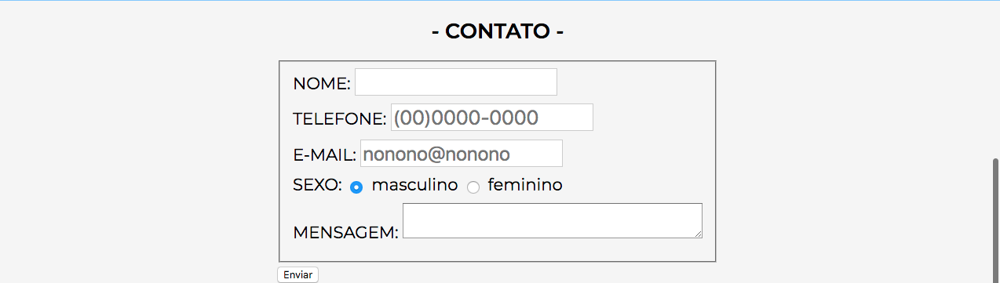

# Desafio Site da Prova - Animação

## Descrição
---

A estrutura básica do site se encontra no arquivo [site.zip](site.zip), e é exigida a criação dos 3 (três) componentes.

## Componentes
---

**COMPONENTE 1 -** Crie a animação de carregamento do site conforme o vídeo 1.

*Vídeo 1 - Animação Banner Principal (No Google Chrome você deve acionar o play)* 
<video width="100%" height="100%" autoplay loop controls>
  <source src="assets/banner.mp4" type="video/mp4">
</video>

No arquivo `main.css` adicione as modificações em `/* TODO COMPONENTE 1 */`.

* Observação 1: A animação inicia com tamanho `0` e vai até o tamanho original.

* Observação 2: A animção utiliza duas funções de transformação.

* Observação 3: O tempo total da animação é de `5s`.

**COMPONENTE 2 -** Crie a transformação dos testemunhos, conforme o vídeo 2.

*Vídeo 2 - Transformação dos ícones dos `Testemunhos` (No Google Chrome você deve acionar o play)* 
<video width="100%" height="100%" autoplay loop controls>
  <source src="assets/testemunhos.mp4" type="video/mp4">
</video>

No arquivo `main.css` adicione as modificações em `/* TODO COMPONENTE 2 */`. Observe que ao passar o mouse por cima dos ícones, eles aumentam o seu tamanho original em `20%` e voltam ao tamanho original com a saída do mouse. Observe que além do ícone aumentar, uma borda `direita` e `baixo` é criada com espessura de `5px`, sólida, `preta` e transparência de `60%`. O tempo total da transformação é de `1s`.

**COMPONENTE 3 -** Crie um formulário conforme a Figura 1.

No arquivo `index.html`, insira o formulário em `<!-- TODO COMPONENTE 3 -->`. No arquivo `main.css`, faça as alterações em `/* TODO COMPONENTE 3 */`.

*Figura 1 - Formulário* 

No CSS, respeite as seguintes configurações:

* Cada bloco do formulário (LABEL + INPUT), tem margem baixo de `.5em`;

* O tamanho da fonte em todo o formulário é `larger`;

* Todos os inputs possuem tamanho da fonte `larger`;

* Usar FLEX para estilizar o formulário.