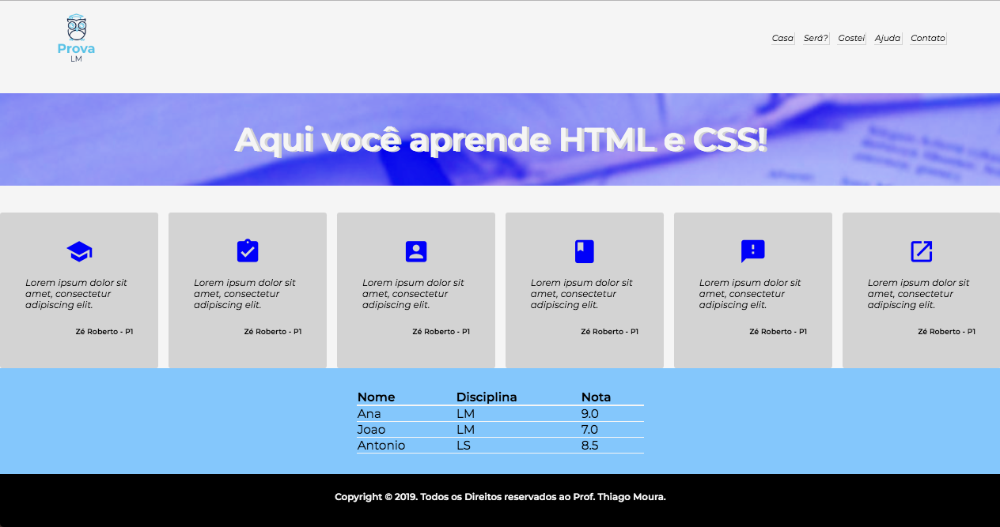
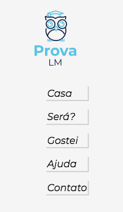
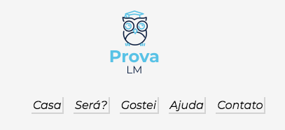
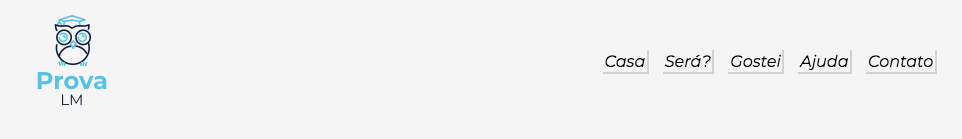
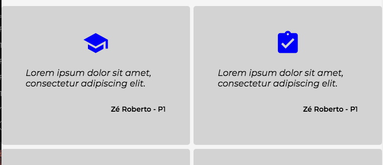
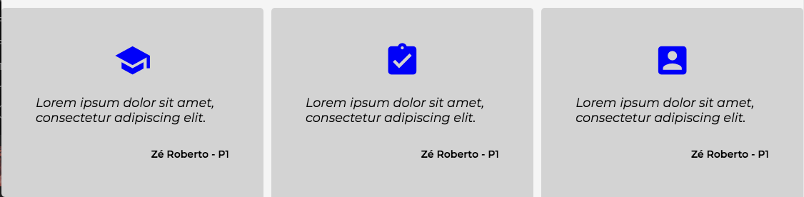
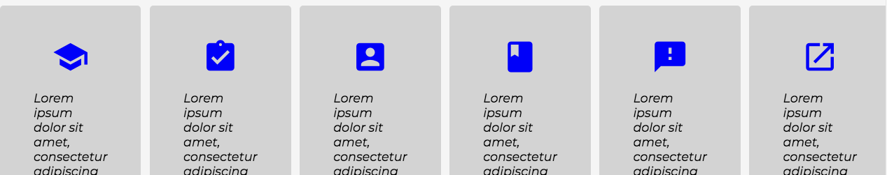
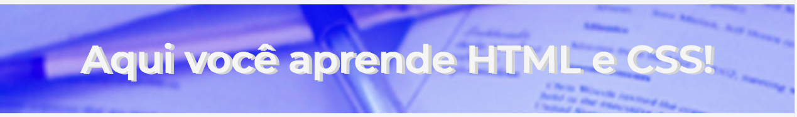

# Desafio: Site da Prova de LM

## Descrição
---

A estrutura básica do site se encontra no arquivo [site.zip](site.zip), e é exigida a criação de TODOS os componentes.

Ao final, o site terá o seguinte aspecto (resolução >= `1200px`):

 

## Componentes
---

**COMPONENTE 1 -** Responsividade do Menu.

O Menu já encontra-se com a seguinte configuração:

*Figura 1 - Menu* 
 

* Agora, transforme a página de forma a ficar responsiva nas sequintes resoluções: `400px` (Figura 1a), `600px` (Figura 1b) e `850px` (Figura 1c):

* No arquivo `main.css`, especificamente em `/* TODO COMPONENTE 1 */`, faça as seguintes alterações, mostradas nas figuras abaixo:

*Figura 1a (`400px`)* 
 
*Figura 1b (`600px`)* 
 
*Figura 1c (`850px`)* 

**COMPONENTE 2 -** Crie a responsividade dos Testemunhos.

* No arquivo `main.css`, especificamente em `/* TODO COMPONENTE 2 */`, faça as seguintes alterações, mostradas nas figuras abaixo:

*Figura 2a (`400px`)* 
 
*Figura 2b (`800px`)* 
 
*Figura 2c (`1200px`)* 

**COMPONENTE 3 -** Estilize o Background do Banner, conforme a Figura 3:

*Figura 3 - Banner* 
 

No arquivo `main.css`, especificamente em `/* TODO COMPONENTE 3 */`, faça as seguintes alterações no Background:

* Usar como cor de background o RGB = (105, 112, 247);
* Usar a imagem `texto.jpg` no background;
* O background é fixo e deve cobrir todo o espaço disponível;
* O backgroung é posicionado a `-100px` no eixo `y`;
* A cor e a imagem se mesclam no modo `overlay`;

> [Alternativa de resposta](site-response/)