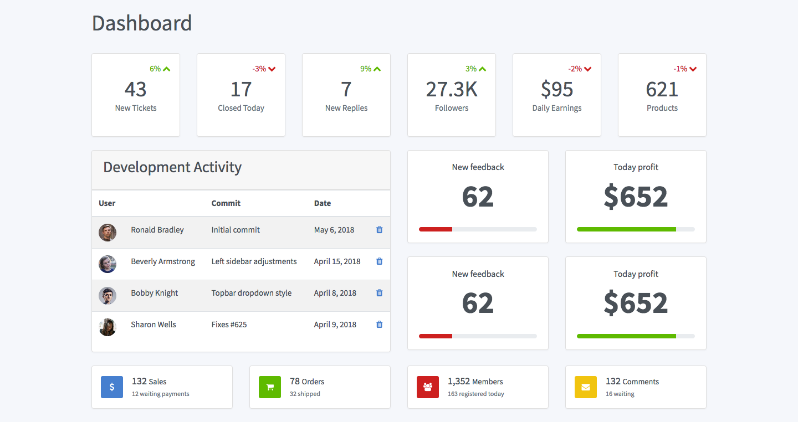
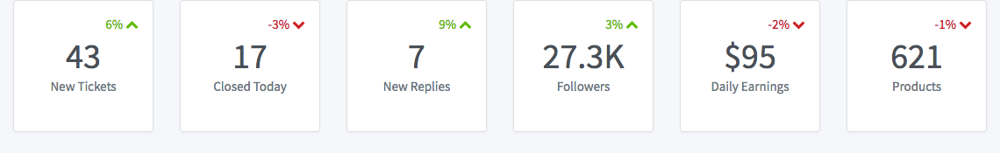
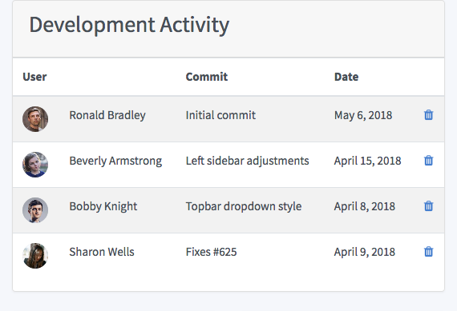
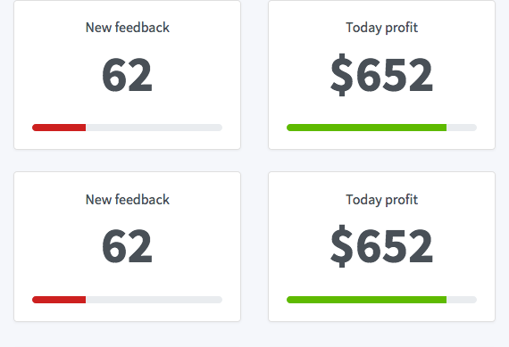
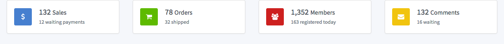

# Dashboard Monitor

## DESCRIÇÃO
---

Na Internet é possível encontrar vários templates de Dashborad Amdin, como por exemplo o [Ample Admin](https://wrappixel.com/ampleadmin/), [Gentelella](https://github.com/puikinsh/gentelella), [DashGum Free Dashboard](http://blacktie.co/2014/07/dashgum-free-dashboard/), [SB Admin](https://github.com/BlackrockDigital/startbootstrap-sb-admin-2), [Admin Lite](https://adminlte.io), [Vuestic Admin](https://github.com/epicmaxco/vuestic-admin), [rdash](https://github.com/rdash/rdash-angular), [CoPilot](https://github.com/misterGF/CoPilot), [modular-admin-html](https://modularcode.io/modular-admin-html/), [antd-admin](https://github.com/zuiidea/antd-admin). A maioria desses templates estão disponíveis em galerias de template, ou até no próprio github.

Pensando em propor uma nova proposta de tema, uma empresa decidiu utilizar o template [tabler](https://tabler.github.io/tabler/) para um de seus sistemas, e está procurando profissionais com essa competência.

O Designer da empresa a princípio fez uma prosposta de layout para testar o template [tabler](https://tabler.github.io/tabler/) presente na *Figura 1*.

*Figura 1 - Proposta de Template*


A empresa até conseguiu iniciar o template, e os arquivos estão disponíveis em [code.zip](code.zip). Contudo, ela está solicitando que os interessados a vaga enviem ao menos dois componentes do layout proposto para ajudar na seleção dessa vaga pretendida.

Detalhe, em [code.zip](code.zip) já existem algumas observações, mas que serão melhor descritos a seguir.

## COMPONENTES
---

**COMPONENTE 1 -** Este componente está relacionado a primeira linha de `cards` do layout proposto, ou seja, especificamente se trata da seção da *Figura 2*.

*Figura 2 - Componente 1*<br>


Então considere que:

* O conteúdo seria esse:

```html
<!-- 
  TODO Component 1 
  
  6% 43 New Tickets fa-chevron-up
  -3% 17 Closed Today fa-chevron-down
  9% 7 New Replies fa-chevron-up
  3% 27.3K Followers fa-chevron-up
  -2% $95 Daily Earnings fa-chevron-down
  -1% 621 Products fa-chevron-down
-->
```

* As cores utilizadas seriam:

```
#cd201f (.text-red)
#5eba00 (.text-green)
```

* A margem inferior dos `cards` seriam `1.5rem`

* Que a estrutura de cada `card` seja definida por:

```html
<div class="card">
  <div class="card-body p-3 text-center">
    <div class="text-right text-green">
      6%
      <i class="fa fa-chevron-up"></i>
    </div>
    <div class="h1 m-0">43</div>
    <div class="text-muted mb-4">New Tickets</div>
  </div>
</div>
```

**COMPONENTE 2** Este componente tem relação com a seção referente à *Figura 3*.

*Figura 3 - Componente 2*<br>


Então considere que:

* O conteúdo seria esse:

```html
<!-- 
  TODO Component 2

  Development Activity
  User	            Commit	                  Date	
  Ronald Bradley	  Initial commit	          May 6, 2018	
  Beverly Armstrong	Left sidebar adjustments	April 15, 2018	
  Bobby Knight	    Topbar dropdown style	    April 8, 2018	
  Sharon Wells	    Fixes #625	              April 9, 2018	 
-->
```

* As imagens da primeira coluna na tabela seriam essas:

```
img/faces/male/9.jpg
img/faces/female/1.jpg
img/faces/male/4.jpg
img/faces/female/11.jpg
```

* O ícone utilizado na última coluna seria esse:

```
fa fa-trash
```

**COMPONENTE 3** Este componente tem relação com a seção referente à *Figura 4*.

*Figura 4 - Componente 3*<br>


Então considere que:

* O conteúdo seria esse:

```html
<!-- 
  TODO Component 3
  
  New feedback 62
  Today profit $652
  New feedback 62
  Today profit $652 
-->
```

* A altura do `progress` seria de .5rem;
* As cores de background seriam:

```
#cd201f (.bg-red)
#5eba00 (.bg-green)
```

**COMPONENTE 4** Este componente tem relação com a seção referente à *Figura 5*.

*Figura 5 - Componente 4*<br>


Então considere que:

* O conteúdo seria esse:

```html
<!-- 
  TODO Component 4

  132 Sales     12 waiting payments
  78 Orders     32 shipped
  1,352 Members 163 registered today
  132 Comments  16 waiting 
-->
```

* Os ícones utilizados seriam:

```
fa fa-dollar
fa fa-shopping-cart
fa fa-users
fa fa-envelope
```

* As cores de plano de fundo dos ícones seriam:

```
#cd201f (.bg-red)
#5eba00 (.bg-green)
#f1c40f (.bg-yellow)
#467fcf (.bg-blue)
```

> **[Alternativa de resposta](code-response/)**