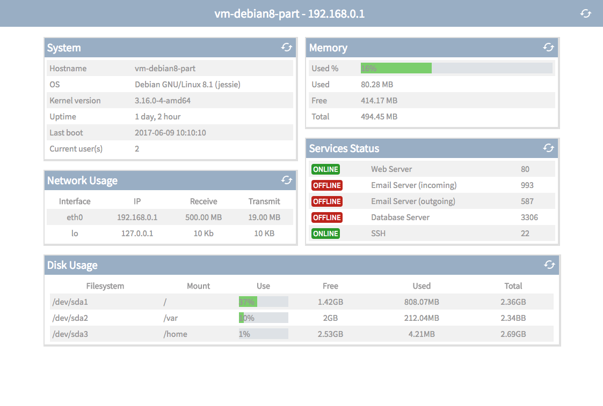
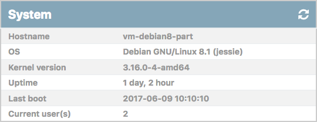
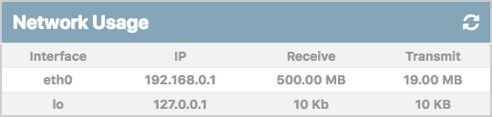
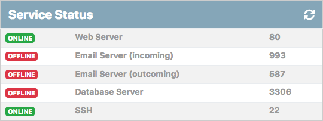
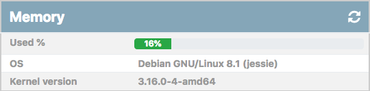
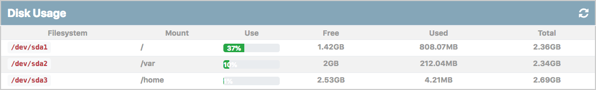

# eZ Server Monitor

## DESCRIÇÃO
---

Considere que a empresa eZ Server Monitor, devido a um problema de backup em seus sistemas, veio em busca de algum profissional no IFPB com domínio nos conceitos de adminstração de sistemas, e que pudesse recriar a página Web de seu sistema [eSM Web](http://ezservermonitor.com/esm-web/features).

A princípio foi disponibilizado a restauração da página do sistema no arquivo [code.zip](code.zip), em uma versão bem inicial, contudo, a ideia é que no final da restauração a página fique semelhante ao da *Figura 1*.

*Figura 1 - Layout da página*

Portanto, cabe a você continuar o desenvolvimento através dos COMPONENTES que serão levantadas a seguir, e cada COMPONENTE será dividido igualmente do valor total a ser pago no final.

Para facilitar nesse processo, cada COMPONENTE abordará um item específico, no qual seu conteúdo será previamente disponibilizado por meio dos arquivos obtidos na restauração. Por exemplo, um dos COMPONENTES solicitará a criação e estilização do painel de informações do sistema, e como ponto de partida, os arquivos disponibilizados já oferecem algum conteúdo, para que assim seja utilizado por você na criação do painel.

> **Observação:** A princípio deve ser entregue ao menos o dois componentes, incluindo o Componente 3.

## COMPONENTES
---

**COMPONENTE 1 -** Crie o conteúdo do Painel de Informação do Sistema no HMTL em `TODO system` considerando que:

* Todas as tabelas dos painéis devem possuir a cor de texto `#989798`, a largura de `98%` e, as margens horizontais e verticais, respectivamente com `5px` e `auto`;
* Nas células destas tabelas deve haver um recuo interno de `5px`;
* As linhas ímpares do corpo da tabela devem possuir a cor de plano de fundo de `#f1f1f1`;
* O painel deve apresentar a aparência conforme a *Figura 2*:

*Figura 2 -Painel de Informação do Sistema* 

**COMPONENTE 2 -** Crie o conteúdo do Painel de Informação do Uso da Rede no HMTL em `TODO network` considerando que:

* Todas as tabelas dos painéis devem possuir a cor de texto `#989798`, a largura de `98%` e, as margens horizontais e verticais, respectivamente com `5px` e `auto`;
* Nas células destas tabelas deve haver um recuo interno de `5px`;
* As linhas ímpares do corpo da tabela devem possuir a cor de plano de fundo de `#f1f1f1`;
* Especificamente a tabela do uso da rede deve possuir o alimento centralizado;
* O painel deve apresentar a aparência conforme a *Figura 3*:

*Figura 3 - Painel de Informação do Uso da Rede* 

**COMPONENTE 3 -** Crie o conteúdo do Painel de Informação dos Serviços no HMTL em `TODO service` considerando que:

* O status, offline ou online, deve possuir cor de texto branco, borda arrendondada de `4px` de raio, texto maiúsculo, recuo interno de `1px 3px` e tamanho de fonte de `.9em`;
* As cores de plano de fundo devem ser `#2b992b` para o status online, e `#bd241c` para offline;
* O painel deve apresentar a aparência conforme a *Figura 4*:

*Figura 4 - Painel de Informação dos Serviços* 

**COMPONENTE 4 -** Crie o conteúdo do Painel de Informação do Uso de Memória no HMTL em `TODO memory` considerando que:

* A segunda coluna de informações da tabela deve possuir uma largura de `80%`;
* O status da memória deve expressar a largura proporcial do seu valor. Nessa configuração será necessário utilizar as cores `#dee2e6` e `#7bce6c`;
* O painel deve apresentar a aparência conforme a *Figura 5*:

*Figura 5 - Painel de Informação do Uso de Memória* 

**COMPONENTE 5 -** Crie o conteúdo do Painel de Informação do Uso das Partições no HMTL em `TODO Disk` considerando que:

* O status do uso das partições deve expressar a largura proporcial do seu valor. Nessa configuração será necessário utilizar as cores `#dee2e6` e `#7bce6c`;
* O painel deve apresentar a aparência conforme a *Figura 6*:

*Figura 6 - Painel de Informação do Uso das Partições* 

> **[Alternativa de resposta](code-response/walisson/) (Proposta de [Walisson Silva](https://github.com/walissonsilva))**