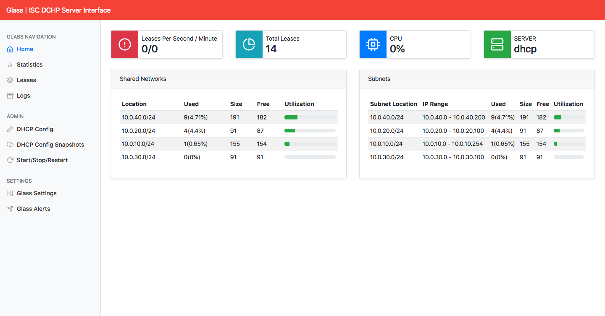
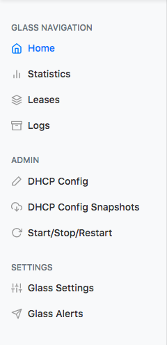
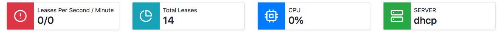
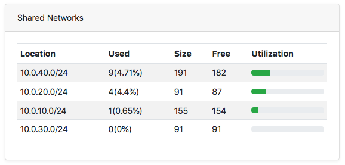
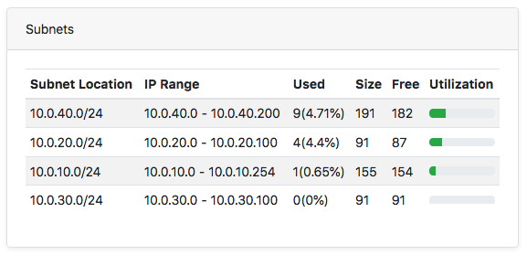

# Glass ISC DHCP

## DESCRIÇÃO
---

O projeto *open source* [Akkadius/glass-isc-dhcp](https://github.com/Akkadius/glass-isc-dhcp) é uma interface projetada para administrar o serviço ISC DHCP, veja a *Figura 1*.

*Figura 1 - Interface do Glass ISC DHCP*

[Fonte: [Dockerized Glass - ISC DHCP Server Interface](https://dodgydudes.se/dockerized-glass-isc-dhcp-server-interface/)]

Em seu repositório, foi descrito na [Issue #11](https://github.com/Akkadius/glass-isc-dhcp/issues/11) uma demanda de trabalho na para atualização do projeto. Dentre as várias contribuições possíveis, uma delas poderia ser a modernização da interface, que originalmente foi construído utilizando o template de painel administrativo do Bootstrap chamado de [AdminBSB](https://github.com/gurayyarar/AdminBSBMaterialDesign). 

Então, a modernização da interface poderia ser conduzida com a reescrita da página usando a versão mais recente do Bootstrap, inclusive utilizando o template
[Dashboard](http://getbootstrap.com/docs/4.1/examples/dashboard/#) da própria galeria de [templates do Bootstrap](https://getbootstrap.com/docs/4.1/examples/). Uma proposta seria semelhante ao resultado da *Figura 2*.

*Figura 2 - Proposta de Template*


Digamos que o projeto já conseguiu iniciar o template, e os arquivos estão disponíveis em [code.zip](code.zip). Contudo, o código ainda está incompleto e possui algumas observações de como concluí-lo, que mais adiante serão melhor descritos.

**Obs:** O template usa a biblioteca de ícones [Feather](https://feathericons.com), que exige o seguinte código para exibir o ícone `home`:

```html
<span data-feather="home"></span>
```

## COMPONENTES
---

**COMPONENTE 1 -** Este componente está relacionado ao menu lateral do layout proposto, ou seja, especificamente se trata da *Figura 3*.

*Figura 3 - Componente 1*<br>


Então considere que o menu está incompleto e que:

* O conteúdo restante seria esse:

```html
<!-- 
  TODO Component 1 

  ADMIN
  DHCP Config (icon: edit-2)
  DHCP Config Snapshots (icon: download-cloud)
  Start/Stop/Restart (icon: rotate-cw)
  
  SETTINGS
  Glass Settings (icon: sliders)
  Glass Alerts (icon: send)
  
-->
```

**COMPONENTE 2 -** Este componente está relacionado a primeira linha de `cards` do layout proposto, ou seja, especificamente se trata da *Figura 4*.

*Figura 4 - Componente 2*<br>


Então considere que:

* O conteúdo seria esse:

```html
<!-- 
  TODO Component 2

  (icon: alert-circle)
  Leases Per Second / Minute
  0/0

  (icon: pie-chart)
  Total Leases
  14

  (icon: cpu)
  CPU
  0%

  (icon: server)
  SERVER
  dhcp
-->
```

* A estrutura de cada `card` seja definida por:

```html
<div class="card d-flex flex-row">
  <div class="prepend-icon p-3 d-flex align-items-center">
    <span data-feather="alert-circle"></span>
  </div>
  <div class="p-2">
    <p>Leases Per Second / Minute</p>
    <h4>0/0</h2>
  </div>
</div>
```

* O `<p>` e `<h4>` devem possuir margem nula (Bootstrap > Utilities > Spacing).

* O `.card` deve possuir uma sombra pequena (Bootstrap > Utilities > Shadows)

* Os ícones `.prepend-icon` devem possuir cor de texto e plano de fundo correspondente à proposta (Boostrap > Utilities > Colors).

**COMPONENTE 3** Este componente tem relação com a seção referente à *Figura 5*.

*Figura 5 - Componente 3*<br>


Então considere que:

* O conteúdo seria esse:

```html
<!--  
  TODO Component 3

  Shared Networks
  Location      Used     Size Free Utilization
  10.0.40.0/24  9(4.71%) 191  182  25%
  10.0.20.0/24  4(4.4%)  91   87   20%
  10.0.10.0/24  1(0.65%) 155  154  10%
  10.0.30.0/24  0(0%)    91   91    0%

-->
```

* Ao construir a tabela deve-se aplicar os estilos necessários para alcançar o resultado proposto (Boostrap > Content > Tables).

* A barra de progresso, `.progress`, deve possuir uma altura de `.6rem`, e para alinhar verticalmente a célula que o contém aplique a classe `align-middle`.

**COMPONENTE 4** Este componente tem relação com a seção referente à *Figura 6*.

*Figura 6 - Componente 4*<br>


Então considere que:

* O conteúdo seria esse:

```html
<!--  
  TODO Component 4

  Subnets
  Subnet Location IP Range                 Used     Size Free Utilization
  10.0.40.0/24    10.0.40.0 - 10.0.40.200  9(4.71%) 191  182  25%
  10.0.20.0/24    10.0.20.0 - 10.0.20.100  4(4.4%)  91   87   20%
  10.0.10.0/24    10.0.10.0 - 10.0.10.254  1(0.65%) 155  154  10%
  10.0.30.0/24    10.0.30.0 - 10.0.30.100  0(0%)    91   91    0%

-->
```

* Ao construir a tabela deve-se aplicar os estilos necessários para alcançar o resultado proposto (Boostrap > Content > Tables).

* A barra de progresso, `.progress`, deve possuir uma altura de `.6rem`, e para alinhar verticalmente a célula que o contém aplique a classe `align-middle`.

<br>
<br>
> **[Alternativa de resposta](code-response/)**