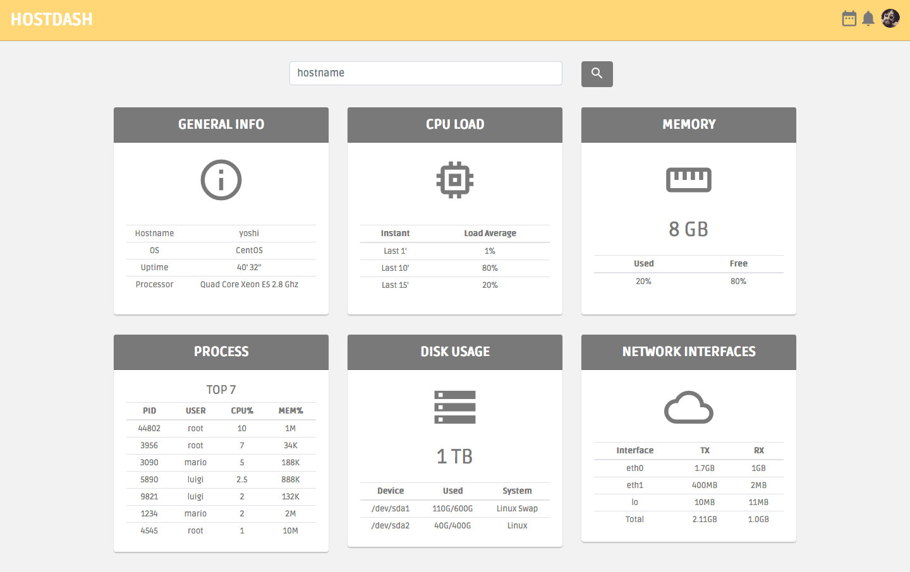
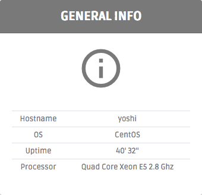
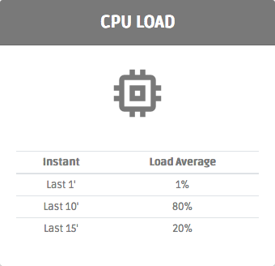
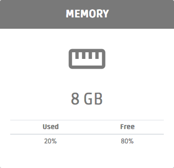
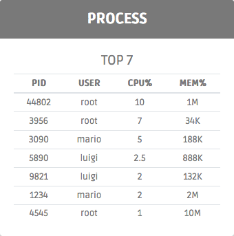
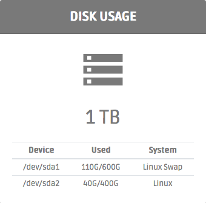
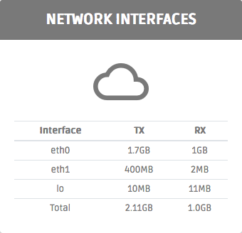

# Host Monitor

## DESCRIÇÃO
---

Considere que o IFPB está com uma demanda técnica relacionado ao monitoramento de algumas máquinas, no qual foi exigido exibir algumas métricas como status da CPU, memória, processos, disco, rede etc. Ao analisar o mercado foi possível encontrar muitos ferramentas que atendiam essa demanda. 

Como as métricas já eram pré-definidas, logo uma opção considerada interessante foi a aplicação Web open source
[Linux Dash](https://github.com/afaqurk/linux-dash), contudo foi solicitado que houvesse uma adaptação em sua interface para se assemelhar ao template [DashGum Free Dashboard](http://blacktie.co/2014/07/dashgum-free-dashboard/).

Então, diante dessa problemática, a DTI abriu um processo de seleção com os alunos do IFPB para recrutar alguém com domínio no tema, e que pudesse criar o sistema de monitoramento Web.

A princípio foi disponibilizado um layout de como seria o sistema neste arquivo, o [code.zip](code.zip), em uma versão bem inicial já inicializada por um funcionário do setor, mas, a ideia é que no final a página fique semelhante ao da *Figura 1*. Portanto, cabe a você candidato continuar o desenvolvimento através das questões que serão levantadas a seguir.

*Figura 1 - Layout da página*<br>


Resumidamente o layout é dividido em duas áreas principais, o cabeçalho e a área principal de conteúdo. Cada uma dessas áreas apresentam itens com aparências específicas, que devem ser preservados o mais próximo possível do comportamento  estrutural e do estilo apresentado na Figura 1.

Para facilitar esse processo, o desenvolvimento será distribuido em **componentes** e alguns conteúdos serão previamente disponibilizados por meio do arquivo obtido, por exemplo, um dos componentes será o painel de informações do Host selecionado, e como ponto de partida, o arquivo `index.html` oferece em `TODO Painel de Informações Gerais` os dados a seguir:

> General Info<br>
> material-icons info_outline<br>
> Hostname	yoshi<br>
> OS	CentOS<br>
> Uptime	40' 32''<br>
> Processor	Quad Core Xeon E5 2.8 Ghz<br>

para que seja utilizado na criação da estrutura do HTML e estilização do CSS do painel. Também é importante destacar que `material-icons` se refere aos ícones do [Material Icons](https://material.io/icons/).

> **Observação:** A princípio deve ser entregue no mínimo dois paineis.

## COMPONENTES
---

**COMPONENTE 1 -** Crie o conteúdo do Painel de Informações Gerais, no arquivo [`code/index.html`](code/index.html), especificamente em `TODO Painel de Informações Gerais`:

```html
<!--
  TODO Painel de Informações Gerais
  General Info
  material-icons info_outline
  Hostname	yoshi
  OS	CentOS
  Uptime	40' 32''
  Processor	Quad Core Xeon E5 2.8 Ghz
-->
```

mas considerando que:

* O painel será construíndo usando um `card` do [Bootstrap](http://getbootstrap.com) que ocupará 1/3 do `main`;
* O `card` deve centralizar o alinhamento do texto, sua altura mínima deve ser de `330px`, a sombra de borda de `0 2px 1px rgba(0, 0, 0, 0.2)`, e não deve possuir borda;
* Quando o cursor estiver sobre o `card`, a sombra de borda deve ser `2px 3px 2px rgba(0, 0, 0, 0.3)`;
* O cabeçalho do `card` deve possuir cor de plano de fundo com `#797979`, a cor de texto branca, o texto em negrito,  recuo interno de .7rem e o tamanho de fonte 30% maior que o elemento raiz;
* O seu ícone deve possuir tamanho de `6rem` e margem inferior de `2rem`;
* A tabela não deve possuir margem e suas células deve possuir um recuo interno de `.2rem`;
* O painel deve apresentar a aparência conforme a *Figura 2*:

*Figura 2 - Painel de informações dos hosts.*<br>


**COMPONENTE 2 -** Crie o conteúdo do Painel de Carga da CPU, no arquivo [`code/index.html`](code/index.html), especificamente em `TODO Painel de Carga da CPU`:

```html
<!--
  TODO Painel de Carga da CPU
  cpu load
  material-icons memory
  Instant	Load Average
  Last 1'	1%
  Last 10'	80%
  Last 15'	20%
-->
```

mas considerando que:

* O componente deve receber o mesmo estilo da tabela e do `card` no **COMPONENTE 1**;
* O seu ícone deve possuir tamanho de `6rem` e margem inferior de `2rem`;
* O painel deve apresentar a aparência conforme a *Figura 3*:

*Figura 3 - Painel sobre a Carga da CPU.*<br>



**COMPONENTE 3 -** Crie o conteúdo do Painel de Carga da Memória, no arquivo [`code/index.html`](code/index.html), especificamente em `TODO Painel de Carga da Memória`:

```html
<!--
  TODO Painel da Carga da Memória
  memory
  material-icons straighten
  8 GB
  Used	Free
  20%	80%
-->
```

mas considerando que:

* O componente deve receber o mesmo estilo da tabela e do `card` no **COMPONENTE 1**;
* O seu ícone deve possuir tamanho de `6rem` e margem inferior de `1rem`;
* O tamanho total da memória deve possuir tamanho de `2rem` e margem inferio de `1rem`;
* O painel deve apresentar a aparência conforme a *Figura 4*:

*Figura 4 - Painel sobre a Carga da Memória.*<br>


**COMPONENTE 4 -** Crie o conteúdo do Painel dos processos TOP 7, no arquivo [`code/index.html`](code/index.html), especificamente em `TODO Painel dos processos TOP 7`:

```html
<!--
  TODO Painel dos processos TOP 7
  process
  top 7
  PID	USER	CPU%	MEM%
  44802	root	10	1M
  3956	root	7	34K
  3090	mario	5	188K
  5890	luigi	2.5	888K
  9821	luigi	2	132K
  1234	mario	2	2M
  4545	root	1	10M
-->
```

mas considerando que:

* O componente deve receber o mesmo estilo da tabela e do `card` no **COMPONENTE 1**;
* O Título `TOP 7` deve possuir tamanho de `1.2rem`;
* O painel deve apresentar a aparência conforme a *Figura 5*:

*Figura 5 - Painel sobre os Processos TOP 7.*<br>


**COMPONENTE 5 -** Crie o conteúdo do Painel do Uso do Disco, no arquivo [`code/index.html`](code/index.html), especificamente em `TODO Painel do Uso do Disco`:

```html
<!--
  TODO Painel do Uso do Disco
  disk usage
  material-icons storage
  1 TB
  Device	Used	System
  /dev/sda1	10G/100G	Linux Swap
  /dev/sda2 *	40G/400G	Linux
  /dev/sda3	100G/500G	Linux
-->
```

mas considerando que:

* O componente deve receber o mesmo estilo da tabela e do `card` no **COMPONENTE 1**;
* O seu ícone deve possuir tamanho de `6rem` e margem inferior de `1rem`;
* O tamanho total da memória deve possuir tamanho de `2rem` e margem inferio de `1rem`;
* O painel deve apresentar a aparência conforme a *Figura 6*:

*Figura 6 - Painel sobre o Uso do Disco.*<br>


**COMPONENTE 6 -** Crie o conteúdo do Painel de Intefaces, no arquivo [`code/index.html`](code/index.html), especificamente em `TODO Painel de Intefaces`:

```html
<!--
  TODO Painel de Interfaces
  network interfaces
  material-icons cloud_queue
  Interface	TX	RX
  eth0	1.7GB	1GB
  eth1	400MB	2MB
  lo	10MB	11MB
  Total	2.11GB	1.0GB
-->
```

mas considerando que:

* O componente deve receber o mesmo estilo da tabela e do `card` no **COMPONENTE 1**;
* O seu ícone deve possuir tamanho de `6rem` e margem inferior de `1rem`;
* O tamanho total da memória deve possuir tamanho de `2rem` e margem inferio de `1rem`;
* O painel deve apresentar a aparência conforme a *Figura 7*:

*Figura 7 - Painel sobre o Uso da Rede.*<br>


> **[Alternativa de resposta](code-response/)**