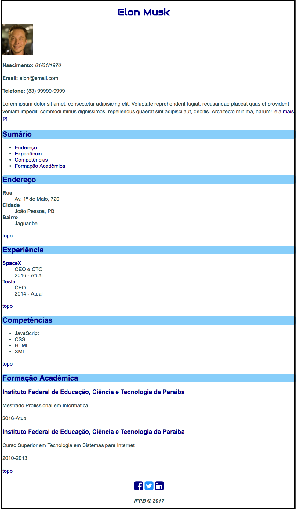
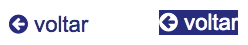

# Curriculum Vitae Estilizado com Ícone e Web Fonte

## Objetivo

O objetivo desta atividade consiste em abordar os seguintes temas:

- Configurar e usar fontes do [Google Fonts](https://fonts.google.com/)
- Configurar e usar ícones do [Material Icon](https://material.io/icons/) e do [Font Awesome](http://fontawesome.io/)
- Estilizando ícones como texto
- Usar:
  - Properties: `border-radius`, `font-family`, `font-size`, `text-align`, `color`, `background-color`, `text-decoration`
  - Value: `<length> (em)`

## Descrição

O Elon Musk gostaria de criar seu Curriculum Vitae, a princípio ele forneceu, textualmente, algumas informações que estão disponíveis no arquivo [site.zip](site.zip). Nele encontram-se sua foto e algumas descrições, que juntos deverão ser apresentados em um navegador Web, conforme ilustra a *Figura 1*.

*Figura 1* - Layout do Currículum com Estilo


Para alcançar tal propósito tente adicionar alguns estilos sugeridos a seguir por meio da linguagem CSS. **Obs.:** Os arquivos e diretórios do site apresentam a estrutura a seguir:

```
site
├── css
│   └── style.css
├── img
│   └── elon.jpg
├── index.html
└── pages
    └── resumo.html
```

As instruções passadas para gerar o currículos, conforme a *Figura 1*, são:

**INSTRUÇÃO 1.** Aplique ao `<h1>` a tipo de fonte Audiowide disponibilizado pelo [Google](https://fonts.googleapis.com/css?family=Audiowide), da família cursiva, e com o tamanho da fonte igual a `30px`.

**INSTRUÇÃO 2.** Adicione no `<h2>` o `border-radius` com valor de `5px`.

**INSTRUÇÃO 3.** Acrescente no final do hyperlink `leia mais` o ícone `launch` do [Material Icon](https://material.io/icons/) disponibilizado pelo [Google](](https://fonts.googleapis.com/icon?family=Material+Icons)). No entanto, no documento, altere o tamanho de sua fonte para `1rem`. Altere também a altura da linha do ícone e também dos paragráfos para `1.5rem`.

**INSTRUÇÃO 4.** No arquivo `pages/resumo.html` crie um botão conforme a *Figura 2* composto pelo ícone `fa-arrow-circle-left`, do [Font Awesome](http://fontawesome.io/) disponibilizado por [CDNJS](https://cdnjs.cloudflare.com/ajax/libs/font-awesome/4.7.0/css/font-awesome.min.css), e a palavra `voltar`. Este botão deverá estar em um hiperlink referenciando o arquivo `index.html`. Internamente o botão deverá conter uma classe chamada `btn`, que define o tamanho de fonte de `1.3rem`. Porém, quando o cursor estiver sobre este botão a cor do texto deverá ser `branca`, o plano de fundo `darkblue` e sem o `sublinhado`.

*Figura 2* - Aparências do botão voltar <br>


**INSTRUÇÃO 5.** Adicione ao bloco, cujo o id é `social`, três hiperlinks, cada um contendo os seguintes ícones do [Font Awesome](http://fontawesome.io/): `fa-facebook-square`, `fa-twitter-square`, `fa-linkedin-square`. Estes hiperlinks devem estar `centralizados` dentro do bloco, com a cor de texto `branca` e tamanho de fonte `2rem`. Os ícones `fa-facebook-square`, `fa-twitter-square`, `fa-linkedin-square` devem ser apresentados, respectivamente, nas cores `navy`, `dodgerblue`, `navy`.

**INSTRUÇÃO 6.** Na visualização de impressao de ambos os documentos html:

**a)** O `<body>` e o `<h1>` devem apresentar a cor de texto `preta` e o tipo de fonte `Times, serif`;

**b)** O Título `<h1>` de id `elon` deve estar alinhado a `esquerda`;

**c)** O Título `<h2>` deve possuir o plano de fundo com o valor `unset`;

**d)** Os Hiperlinks em `<h2>` e que os que possuem a classe `topo` devem possuir a cor de texto `branca`;

<!-- TODO ocultar ícones -->

> [Alternativa de resposta](site-response/index.html).
