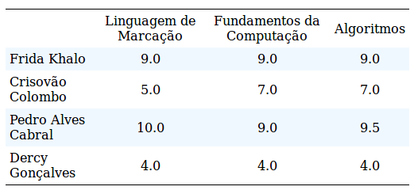

# Estilizando tabelas

## Objetivo
---

O objetivo desta atividade consiste em abordar os seguintes temas:

- Criar e estilizar tabelas
    - Centralizar tabela
    - Aplicando plano de fundo em tabelas
    - Colapsando tabela
- Trabalhar com bordas, margens e recúo interno (box model)
- Definindo Largura
- Usar as Propriedades:
    - `font-family`, `font-size`, `text-align`
    - `background-color`
    - `border`, `border-bottom`, `border-collapse`, `border-top`
    - `margin`, `margin-top`
    - `padding`
    - `width`, `min-width`

## Descrição
---

A tabela é um elemento do HTML que permite exibir um conjunto de dados de modo bastante interessante, pois ao agrupar um conjunto de regristros em linhas facilita a comparação entre dados do registro por meio das colunas.

Pensando em estimular a criação de um tabela HTML é que este exercício propoe a criação de duas tabelas. O esboço necessário para ambas tabelas pode ser acessado neste [arquivo](site.zip), no qual ainda falta definir estrutura e estilo, e as instruções de estilização encontram-se documentados em cada documento HTML.

### Tabela Climática

Gere uma `<table>` que contenha informações climáticas, de uma determinada cidade, para cada dia da semana. Os dados para preenchimento desta table estão na *Tabela 1* (esta ilustra a exibição esperada como resposta deste exercício).

*Tabela 1 - Tabela Climática* 

A `<table>` deve seguir os seguintes padrões de estilos:

**INSTRUÇÃO 1.** Todo o texto deverá estar centralizado, com fonte `"Times New Roman", Times, serif`, de tamanho de fonte de `12px`;

**INSTRUÇÃO 2.** Largura (`width`) da tabela em 20%;

**INSTRUÇÃO 3.** A tabela terá cor de fundo igual a `rgb(240,248,255)`;

**INSTRUÇÃO 4.** Apenas os th's e td's deverão ter bordas `"1px solid black"`, e padding de `5px`;

**INSTRUÇÃO 5.** A linha que contém os th's deverá estar na cor `rgb(168, 218, 213)`. No entanto, se o mouse estiver posicionado sobre qualquer outra linha, esta também deverá estar com o mesmo rgb, voltando a cor anterior, com a saída do mouse (usar a propriedade `hover`).

**INSTRUÇÃO 6.** Os ícones para cada condição climática (coluna Tempo) serão os do Weather Icons. A documentação de como inserí-los no HTML encontra-se na [Página do Weather Icons](https://erikflowers.github.io/weather-icons). No entanto, o link para o seu CSS já encontra-se referenciado neste arquivo. Para cada dia da semana, considere os seguintes ícones:

| Dia     | Nome do Ícone    |
| ------- | ---------------- |
| Domingo | wi-day-cloudy    |
| Segunda | wi-day-sunny     |
| Terça   | wi-day-rain      |
| Quarta  | wi-day-lightning |
| Quinta  | wi-day-windy     |
| Sexta   | wi-cloudy        |
| Sábado  | wi-day-cloudy    |

### Tabela de Notas

Gere uma table que contenha as notas de disciplinas de alguns ilustres alunos. Os dados para preenchimento desta `<table>` estão na *Tabela 2* (esta ilustra a exibição esperada como resposta deste exercício).

*Tabela 2 - Tabela de Notas* 

A `<table>` deve seguir os seguintes padrões de estilos:

**INSTRUÇÃO 1.** Todo o texto deverá estar centralizado, exceto os nomes dos alunos que deverão estar com alinhamento a esquerda.

**INSTRUÇÃO 2.** Largura (`width`) da tabela em `50%`, `min-width` de `300px`, e com `margin` `auto`;

**INSTRUÇÃO 3.** Bordas com `collapse`

**INSTRUÇÃO 4.** Margem de distância do topo de `50px`;

**INSTRUÇÃO 5.** Borda do topo e da base (baixo) com `1px solid black`;

**INSTRUÇÃO 6.** As linhas ímpares, que contém os nomes dos alunos, deverão estar com o plano de fundo na cor `rgb(240,248,255)`.

> Alternativas de respostas: [Tabela Climática](site-response/tabela-climatica/) e [Tabela de Notas](site-response/tabela-notas/).