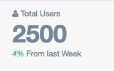
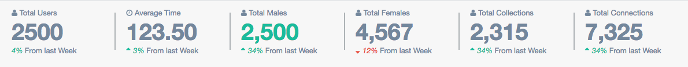
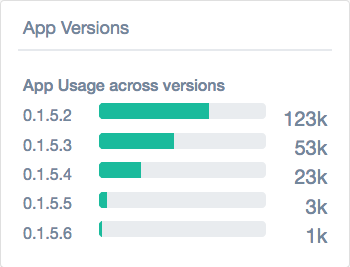
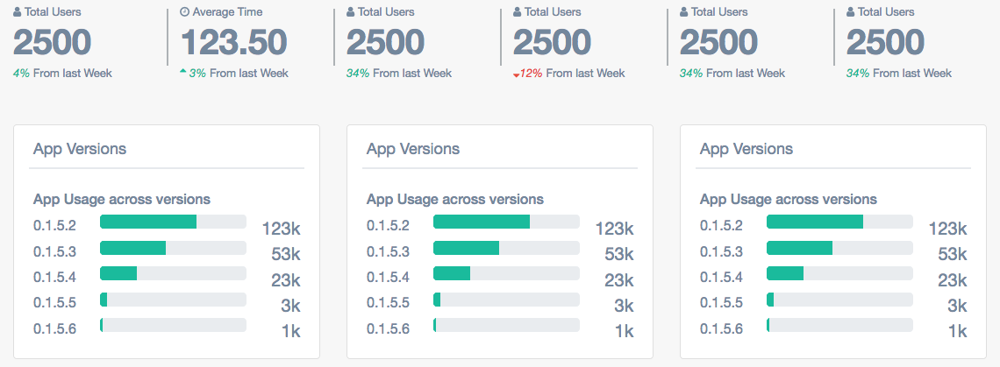
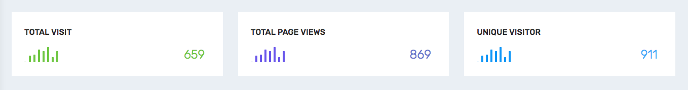
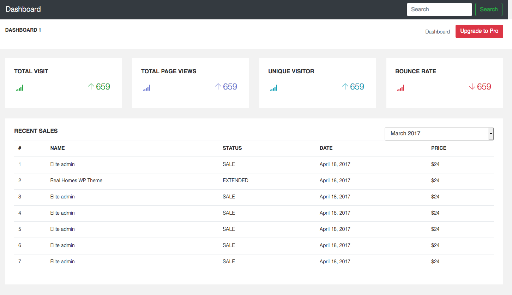

# Criando Dashboard Admin

## Objetivos
---

O objetivo desta atividade consiste em abordar os seguintes temas:

- Analisar e adaptar template existentes;
- Inspecionar elementos para compreender sua estrutura e estilo;
- Criar Dashboards Admin com Bootstrap.

## Descrição
---

A criação de sistemas ou aplicativos geralmente exige a criação de interfaces centralizadas para ajudar no controle e acompanhamento de seu funcionamento. Nesse cenário é muito comum ver uma interface que popularmente é conhecida com *Dashborad Admin*, e sua principal característica consiste em tentar concentrar o máximo de informação em um ou conjundo de paineis de informações.

A seguir, será proposto alguns desafios baseados em alguns templates de *Dashborad Admin*.

### [Gentelella Template](https://github.com/puikinsh/gentelella)

O template Gentelella é um interface disponível no github [puikinsh/gentelella](https://github.com/puikinsh/gentelella) que pode ser visto neste [demo](https://colorlib.com/polygon/gentelella/index.html), e se destaca pela harmonia entre as cores e o layout dos paineis de informações.

**INSTRUÇÃO 1 -** Para ajudar a compreender sua estrutura é recomendado que seja criado inicialmente a caixa de informação da *Figura 1*.

*Figura 1 - Caixa de Informação* 

**INSTRUÇÃO 2 -** Através da conclusão do elemento da *Figura 1* tente criar o painel da *Figura 2*. Veja o [demo](https://colorlib.com/polygon/gentelella/index.html) e tente preservar o seu design responsivo.

*Figura 2 - Barra de Informações* 

**INSTRUÇÃO 3 -** Crie o painel de versão de aplicações da *Figura 3*.

*Figura 3 - Painel Versão de Aplicações* 

**INSTRUÇÃO 4 -** Reuna os paineis do Gentelella conforme a *Figura 4*.

*Figura 4 - Paineis do Gentelella* 

### [Ample Admin](https://wrappixel.com/ampleadmin/)

O template Ample Admin é um template disponível no [WrapPixel](https://wrappixel.com). Esse templete possui algumas variantes como a versão [Lite](https://wrappixel.com/templates/ample-admin-lite/) e [Advanced](https://wrappixel.com/ampleadmin/). 

**INSTRUÇÃO 5 -** Então baseado na versão do Ample Admin [Lite](https://wrappixel.com/templates/ample-admin-lite/) tente reproduzir o painel da *Figura 5*.

*Figura 5 - Painel Estatístico do Ample Admin* 

**INSTRUÇÃO 6 -** Por fim, tente gerar os paineis da *Figura 6*.

*Figura 6 - Paineis do Ample Admin* 

<!-- > Alternativa de resposta:  -->