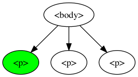
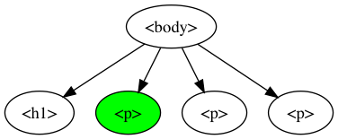
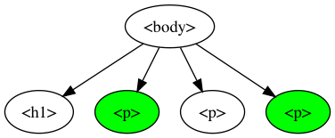

# [Selectors](https://docs.webplatform.org/wiki/css/selectors)

* [Basic selectors](#basic-selectors)
  * [Element](#element)
  * [`#id`](#id)
  * [`.class`](#class), [`.class.class`](#classclass)
* [Combinators](#combinators)
  * [Descendant combinator](#descendant-combinator)
* [Pseudo-class](#pseudo-class)
  * [`:hover`](#hover)
  * [`:first-child`](#first-child)
  * `:nth-child()`: [`:nth-child(2)`](#nth-child2), [`:nth-child(2n)`](#nth-child2n)
* [Pseudo-element](#pseudo-element)
  * [`::selection`](#selection)
* [Group of Selectors](#group-of-selectors)

## Basic selectors
---

### Element

[examples/span.html](examples/span.html)
```css
h1 {
  color: blue;
}

span {
  font-weight: bold;
  font-size: 1.2rem;
  color: tomato;
}
```

```html
<h1>Lorem ipsum dolor</h1>
<p>Lorem ipsum, <span>dolor</span> sit amet consectetur adipisicing elit. Id, quia...</p>
```

Output:

<div style="border-radius: 0.3rem; border: solid 1px #dce6f0; padding: 0.8rem;">
  <h1 style="color: blue;">Lorem ipsum dolor</h1>
  <p>Lorem ipsum, <span style="font-weight: bold; font-size: 1.2rem; color: tomato;">dolor</span> sit amet consectetur adipisicing elit. Id, quia...</p>
</div>

[examples/div.html](examples/div.html)
```css
div {
  color: tomato;
}
```

```html
<h1>Lorem ipsum</h1>
<p>Lorem ipsum dolor sit amet consectetur adipisicing elit...</p>
<div>
  <p>Expedita, officia rem, non nulla harum ut fugit optio explicabo temporibus eligendi...</p>
  <p>Perferendis eaque ullam harum illum quas repudiandae dolore minima labore quod...</p>
</div>
```

Output:

<div style="border-radius: 0.3rem; border: solid 1px #dce6f0; padding: 0.8rem;">
  <h1 style="color: #606c71;">Lorem ipsum dolor</h1>
  <p>Lorem ipsum dolor sit amet consectetur adipisicing elit...</p>
  <div style="color: tomato;">
    <p>Expedita, officia rem, non nulla harum ut fugit optio explicabo temporibus eligendi...</p>
    <p>Perferendis eaque ullam harum illum quas repudiandae dolore minima labore quod...</p>
  </div>
</div>

### `#id`

[examples/id.html](examples/id.html):
```css
p {
  color: green;
}

#first {
  color: red;
}
```

```html
<body>
  <h1>Lorem ipsum</h1>
  <p id="first">Lorem ipsum dolor sit amet, consectetur adipisicing elit...</p>
  <p>Eveniet amet laudantium aperiam nisi ratione at, blanditiis...</p>
  <p>Culpa possimus obcaecati laudantium nesciunt consequatur...</p>
</body>
```

Output:

<div style="border-radius: 0.3rem; border: solid 1px #dce6f0; padding: 0.8rem;">
  <h1 style="color: #606c71;">Lorem ipsum</h1>
  <p style="color: red;">Lorem ipsum dolor sit amet, consectetur adipisicing elit...</p>
  <p style="color: green;">Eveniet amet laudantium aperiam nisi ratione at, blanditiis...</p>
  <p style="color: green;">Culpa possimus obcaecati laudantium nesciunt consequatur...</p>
</div>

### `.class`

[examples/class.html](examples/class.html):
```css
p {
  color: green;
}

.red {
  color: red;
}
```

```html
<body>
  <h1>Lorem ipsum</h1>
  <p class="red">Lorem ipsum dolor sit amet, consectetur adipisicing elit...</p>
  <p>Culpa possimus obcaecati laudantium nesciunt consequatur...</p>
  <p class="red">Eveniet amet laudantium aperiam nisi ratione at, blanditiis...</p>
</body>
```

Output:

<div style="border-radius: 0.3rem; border: solid 1px #dce6f0; padding: 0.8rem;">
  <h1 style="color: #606c71;">Lorem ipsum</h1>
  <p style="color: red;">Lorem ipsum dolor sit amet, consectetur adipisicing elit...</p>
  <p style="color: green;">Culpa possimus obcaecati laudantium nesciunt consequatur...</p>
  <p style="color: red;">Eveniet amet laudantium aperiam nisi ratione at, blanditiis...</p>
</div>

### `.class.class`

[examples/classclass.html](examples/classclass.html):
```css
.text-center {
  text-align: center;
}

.red {
  color: red;
}

h1.text-center.red {
  font-size: 3rem;
}
```

```html
<body>
  <h1 class="red text-center">Lorem ipsum</h1>
  <p>Lorem ipsum dolor sit amet, consectetur adipisicing elit...</p>
  <p class="red">Eveniet amet laudantium aperiam nisi ratione at, blanditiis...</p>
  <p>Culpa possimus obcaecati laudantium nesciunt consequatur...</p>
</body>
```

## Combinators
---

### Descendant combinator

[examples/descendant-combinator.html](examples/descendant-combinator.html):
```css
header ul {
  list-style-type: none;
}
```

```html
<body>
  <header>
    <ul>
      <li><a href="#">Menu 1</a></li>
      <li><a href="#">Menu 2</a></li>
    </ul>
  </header>
  <main>
    <ul>
      <li>Item 1</li>
      <li>Item 2</li>
    </ul>
  </main>
</body>
```

Output:

<div style="border-radius: 0.3rem; border: solid 1px #dce6f0; padding: 0.8rem;">
  <header>
    <ul style="list-style-type: none;">
      <li><a href="#">Menu 1</a></li>
      <li><a href="#">Menu 2</a></li>
    </ul>
  </header>
  <main>
    <ul>
      <li>Item 1</li>
      <li>Item 2</li>
    </ul>
  </main>
</div>

### CSS Question

> What is the selection of `body li`? How many elements?<br>

## Pseudo-class
---

### `:hover`

[examples/p-hover.html](examples/p-hover.html)
```css
p:hover {
  font-weight: bold;
}
```

```html
<p>Lorem ipsum dolor sit amet consectetur adipisicing elit. Soluta voluptatem ex autem incidunt, aut dolores veritatis nisi repellat perspiciatis nulla reiciendis eum doloribus fugit facere necessitatibus reprehenderit natus libero temporibus.</p>
```

Output:

<iframe src="examples/p-hover.html" width="100%" style="border-radius: 0.3rem; border: solid 1px #dce6f0; padding: 0.8rem;"></iframe>

### `:first-child`

```css
p:first-child {
  color: green;
}
```

```html
<body>
  <p>Lorem ipsum dolor sit amet, consectetur adipisicing elit...</p>
  <p>Eveniet amet laudantium aperiam nisi ratione at, blanditiis...</p>
  <p>Culpa possimus obcaecati laudantium nesciunt consequatur...</p>
</body>
```



Output:

<div style="border-radius: 0.3rem; border: solid 1px #dce6f0; padding: 0.8rem;">
  <p style="color: green;">Lorem ipsum dolor sit amet, consectetur adipisicing elit...</p>
  <p>Eveniet amet laudantium aperiam nisi ratione at, blanditiis...</p>
  <p>Culpa possimus obcaecati laudantium nesciunt consequatur...</p>
</div>

### `:nth-child(2)`

```css
p:first-child {
  color: red;
}

p:nth-child(2) {
  color: green;
}
```

```html
<body>
  <h1>Lorem ipsum dolor</h1>
  <p>Lorem ipsum dolor sit amet, consectetur adipisicing elit...</p>
  <p>Eveniet amet laudantium aperiam nisi ratione at, blanditiis...</p>
  <p>Culpa possimus obcaecati laudantium nesciunt consequatur...</p>
</body>
```



Output:

<div style="border-radius: 0.3rem; border: solid 1px #dce6f0; padding: 0.8rem;">
  <h1 style="color: #606c71;">Lorem ipsum dolor</h1>
  <p style="color: green;">Lorem ipsum dolor sit amet, consectetur adipisicing elit...</p>
  <p>Eveniet amet laudantium aperiam nisi ratione at, blanditiis...</p>
  <p>Culpa possimus obcaecati laudantium nesciunt consequatur...</p>
</div>

### `:nth-child(2n)`

```css
p:nth-child(2n) {
  color: green;
}
```

```html
<body>
  <h1>Lorem ipsum dolor</h1>
  <p>Lorem ipsum dolor sit amet, consectetur adipisicing elit...</p>
  <p>Eveniet amet laudantium aperiam nisi ratione at, blanditiis...</p>
  <p>Culpa possimus obcaecati laudantium nesciunt consequatur...</p>
</body>
```



Output:

<div style="border-radius: 0.3rem; border: solid 1px #dce6f0; padding: 0.8rem;">
  <h1 style="color: #606c71;">Lorem ipsum dolor</h1>
  <p style="color: green;">Lorem ipsum dolor sit amet, consectetur adipisicing elit...</p>
  <p>Eveniet amet laudantium aperiam nisi ratione at, blanditiis...</p>
  <p style="color: green;">Culpa possimus obcaecati laudantium nesciunt consequatur...</p>
</div>

### CSS Question

> Is it possible to inspect `:hover`?<br>
> Is it possible to replace `:first-child` with `:nth-child`?<br>
> Is it possible to replace general/adjacent sibling combinator selector with `:nth-child`?<br>
> Is it possible to select odd or even elements?<br>

## Pseudo-element
---

### `::selection`
[examples/p-selection.html](examples/p-selection.html)
```css
p::selection {
  color: white;
  background-color: grey;
}
```

```html
<h1>Lorem ispsum dolor</h1>
<p>Lorem ipsum dolor sit amet consectetur adipisicing elit. Soluta voluptatem ex autem incidunt, aut dolores veritatis nisi repellat perspiciatis nulla reiciendis eum doloribus fugit facere necessitatibus reprehenderit natus libero temporibus.</p>
```

Output:

<iframe src="examples/p-selection.html" width="100%" style="border-radius: 0.3rem; border: solid 1px #dce6f0; padding: 0.8rem;"></iframe>

## Group of Selectors 
---

```css
elementname-1, elementname-2
```

```css
h1, p
```

## References
---

* Selectors:
  * Doc: [WP](https://docs.webplatform.org/wiki/css/selectors), [MDN](https://developer.mozilla.org/en-US/docs/Web/CSS/Reference#Selectors), W3C ([Level 3](https://www.w3.org/TR/2011/REC-css3-selectors-20110929/#selectors) e [Level 4](https://www.w3.org/TR/2013/WD-selectors4-20130502/#overview))
  * [Selectors Table](selectors.md)
* Attributes:
  * [global](https://developer.mozilla.org/en-US/docs/Web/HTML/Global_attributes): `id`, `class`
