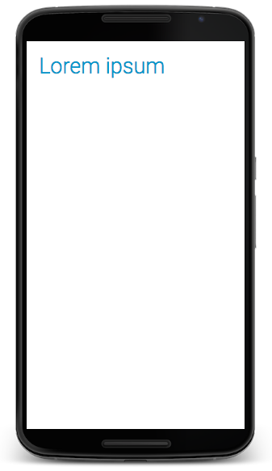

# Style Language

* [Definition](#definition)
* [Problem](#problem)
  * [Android Style](#android-style)
  * [LaTeX Style](#latex-style)
  * [Open Document Style](#open-document-style)
  * [Qt Style](#qt-style)
  * [CSS](#css)
  * [Comparing](#comparing)
* [Remember](#remember)


## Definition
---

Reference:
* [Style Language \| Wikipedia](https://en.wikipedia.org/wiki/Style_language)
* [Style Languague Slide](../slides/style.pdf)

> "Style Language is a computer language that expresses the presentation of structured documents." [Wikipedia](https://en.wikipedia.org/wiki/Style_sheet_language)

## Problem
---

<table>
  <thead>
    <tr>
      <th>Style</th>
      <th>Output</th>
    </tr>
  </thead>
  <tbody>
    <tr>
      <td>Color</td>
      <td style="color: blue">Lorem ipsum</td>
    </tr>
    <tr>
      <td>Size</td>
      <td style="font-size: 3rem">Lorem ipsum</td>
    </tr>
    <tr>
      <td>Bold</td>
      <td style="font-weight: bold">Lorem ipsum</td>
    </tr>
    <tr>
      <td>Italic</td>
      <td style="font-style: italic">Lorem ipsum</td>
    </tr>
    <tr>
      <td>Underline</td>
      <td style="text-decoration: underline">Lorem ipsum</td>
    </tr>
    <tr>
      <td>Font Family</td>
      <td style="font-family: Times">Lorem ipsum</td>
    </tr>
  </tbody>
</table>

### Styling (size + color)

```
Lorem ipsum
```

Output:

<div style="border-radius: 0.3rem;background-color: #f3f6fa;border: solid 1px #dce6f0; padding: 0.8rem;">
  <span style="color: blue; font-size: 2rem;">Lorem ipsum</span>
</div>


### Android Style

Reference: 
* [R.color](https://developer.android.com/reference/android/R.color.html)
* [TextView](https://developer.android.com/reference/android/widget/TextView.html): android:textSize, android:textColor
* [TextView Attributes](https://www.tutorialspoint.com/android/android_textview_control.htm)

[activity_main.xml](activity_main.xml)
```xml
<RelativeLayout xmlns:android="http://schemas.android.com/apk/res/android"
  xmlns:tools="http://schemas.android.com/tools"
  android:layout_width="match_parent"
  android:layout_height="match_parent"
  android:paddingBottom="@dimen/activity_vertical_margin"
  android:paddingLeft="@dimen/activity_horizontal_margin"
  android:paddingRight="@dimen/activity_horizontal_margin"
  android:paddingTop="@dimen/activity_vertical_margin"
  tools:context=".MainActivity" >
   
   <TextView
    android:text="Lorem ipsum"
    android:layout_width="wrap_content"
    android:layout_height="wrap_content"
    android:textSize="36sp"
    android:fontFamily="sans-serif-light"
    android:textColor="@android:color/holo_blue_dark"
    android:padding="20dp"/>

</RelativeLayout>
```

Output:



Fonte: [labs.udacity](http://labs.udacity.com/android-visualizer/)

### LaTeX Style

Reference:
* [Sizing text](https://en.wikibooks.org/wiki/LaTeX/Fonts#Built-in_sizes)
* [Using colours in LaTeX](https://www.sharelatex.com/learn/Using_colours_in_LaTeX)

```tex
\documentclass{article}
\usepackage{color}

\begin{document}

{\color{blue}\Large{Lorem ipsum dolor}}

\end{document}
```

Output: [overleaf](https://www.overleaf.com/read/wtrfpyrdmqvn)
<!-- Read & Edit Link https://www.overleaf.com/15115485pyyyxrrsvbmy -->

### Open Document Style

Reference:
* [Open Document Format for Office Applications (OpenDocument) Version 1.2](http://docs.oasis-open.org/office/v1.2/OpenDocument-v1.2-part1.html)

```xml
<?xml version="1.0" encoding="UTF-8"?>
<office:document-content ... office:version="1.2">
  ...
  <office:automatic-styles>
    ...
    <style:style style:name="T1" style:family="text">
      <style:text-properties fo:color="#0000ff" fo:font-size="18pt" ... />
    </style:style>
  </office:automatic-styles>
  <office:body>
    <office:text>
      ...
      <text:p text:style-name="P1">
        <text:span text:style-name="T1">Lorem ipsum dolor</text:span>
      </text:p>
    </office:text>
  </office:body>
</office:document-content>
```

Output: [tex.odt](text.odt)

### Qt Style

Reference:
* [Qt - The Style Sheet](http://doc.qt.io/qt-5/stylesheet.html)
* [Qt - The Style Sheet Syntax](http://doc.qt.io/qt-5/stylesheet-syntax.html)
* [Qt - Style Sheets Reference](http://doc.qt.io/qt-5/stylesheet-reference.html)

```c++
#include <QApplication>
#include <QLabel>

int main(int argc, char **argv)
{
  QApplication app (argc, argv);

  QLabel* label = new QLabel("Lorem ipsum dolor");
  label->setStyleSheet("QLabel { color : blue; font-size : 17px");
  label->show();

  return app.exec();
}
```

<!-- TODO
Ouput:

 -->

### CSS

Reference:
* [Sintax](https://www.w3.org/TR/css/)

[`text.html`](text.html):
```html
<!DOCTYPE html>
<html lang="en">
<head>
  <meta charset="UTF-8">
  <title>Document</title>
</head>
<body>
  <p style="color:blue;font-size:20px;">Lorem ipsum dolor</p>
</body>
</html>
```

Output:

<div style="border-radius: 0.3rem;background-color: #f3f6fa;border: solid 1px #dce6f0; padding: 0.8rem;">
  <p style="color:blue;font-size:20px;">Lorem ipsum dolor</p>
</div>

#### CSS File

```
site
├── index.html
└── style.css
```

[`site/index.html`](site/index.html):
```html
<!DOCTYPE html>
<html lang="en">
<head>
  <meta charset="UTF-8">
  <title>Document</title>
  <link rel="stylesheet" href="style.css">
</head>
<body>
  <p>Lorem ipsum dolor</p>
</body>
</html>
```

[`site/style.css`](site/style.css):
```css
p {
  color:blue;
  font-size:20px;
}
```

Output:

<div style="border-radius: 0.3rem;background-color: #f3f6fa;border: solid 1px #dce6f0; padding: 0.8rem;">
  <p style="color:blue;font-size:20px;">Lorem ipsum dolor</p>
</div>


### Comparing

| style | Android | LaTeX | ODT | Qt | CSS |
|-|-|-|-|-|-|
| color | android:textColor | \color | color | color | color |
| size | android:textSize | \Large | font-size | font-size | font-size |

## Remember
---

* Style Language have terms that define style properties
* Style Language can work:
  * with other languages
  * declarative and imperative
  * locally or globally