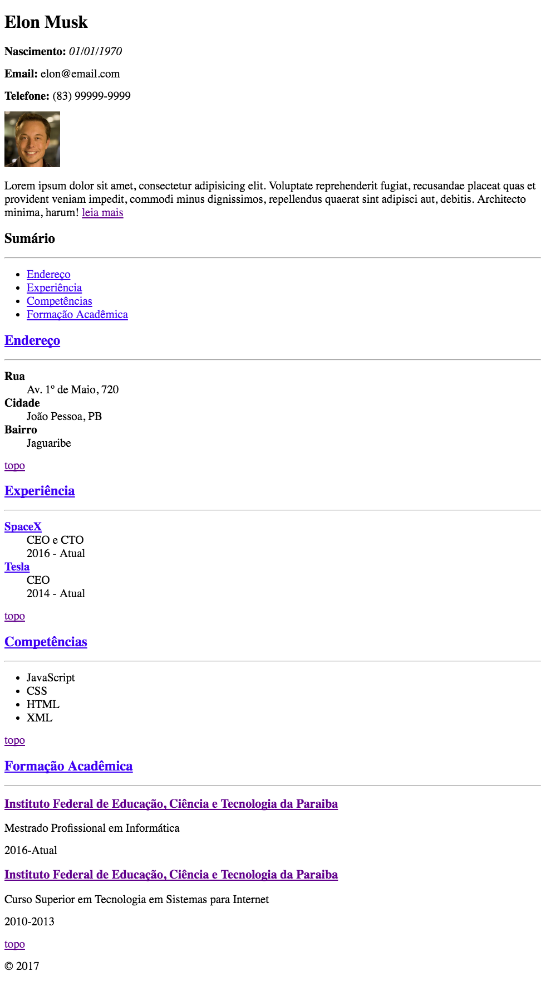
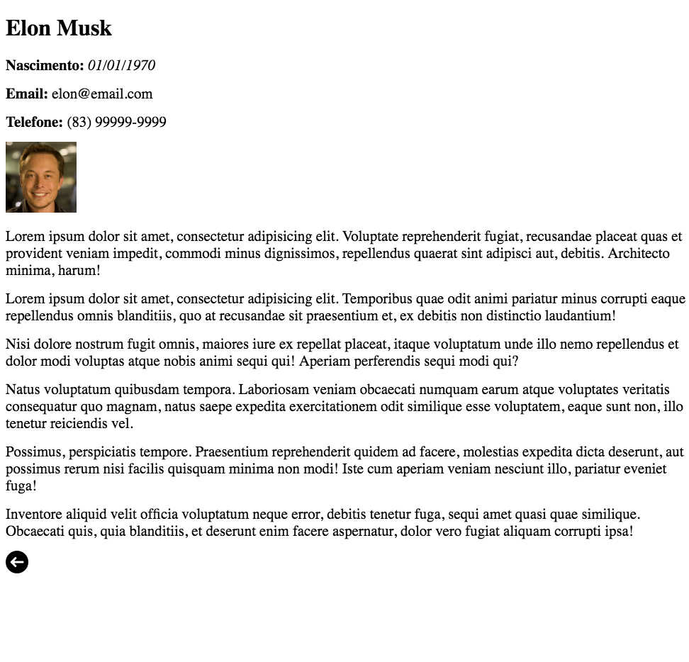

# Curriculum Vitae com Sumário

## Objetivo
---

O objetivo desta atividade consiste em abordar os seguintes tópicos:

- Reconstruir uma página Web Existente
- Criar um texto com ênfase e destaque
- Criar uma imagem
- Criar um hyperlink interno e externo
- Criar uma lista não ordenada
- Criar uma lista de definição
- Criar seções com linhas horizontais
- Utilizar caracteres via entidade
  
## Descrição
---

O Elon Musk gostaria de criar seu Curriculum Vitae, a princípio ele forneceu, textualmente, algumas informações que estão disponíveis no arquivo [site.zip](site.zip). Nele encontram-se sua foto e algumas descrições, que juntos deverão ser apresentados em um navegador Web, conforme ilustra a *Figura 1*.

*Figura 1* - Layout do Currículum


Este exercício trata-se de uma continuação do exercício do Curriculo Vitae, com adição de novos recursos ao conteúdo HTML, dentre eles: o sumário com links internos, criando hiperlink entre páginas do próprio site e imagem com hiperlink.

**Obs.:** Os arquivos e diretórios do site apresentam a estrutura a seguir:

```
site
├── img
│   ├── elon.jpg
│   └── voltar.png
├── index.html
└── pages
    └── resumo.html
```

Conforme ilustra a *Figura 1* o Curriculum deve apresentar uma seção contendo, em uma lista não ordenada, um sumário com links para cada seção listada.

No `index.html` há uma breve descrição/resumo sobre o Elom Musk, no entanto uma descrição mais completa deve encontrar-se em outro documento HTML, que é acessível através do hyperlink **leia mais**. O conteúdo dessa segunda página deve ser conforme ilustra a *Figura 2*. Observe que esta possui uma imagem de uma seta que deve conter um hiperlink para o documento `index.html`.

*Figura 2* - Layout do Resumo


Ainda conforme a *Figura 1*, no final das seções deve haver um hiperlink intitulado **topo** que direciona a navegação para o início do documento (`index.html`). Já com relação aos títulos dessas seções, devem possuir hyperlinks que recaiam para o início de sua própria seção.

Por fim, inclua no final do documento uma informação de copyright, usando entidade do HTML, conforme ilustra a *Figura 1*.

> [Alternativa de resposta](site-response/)