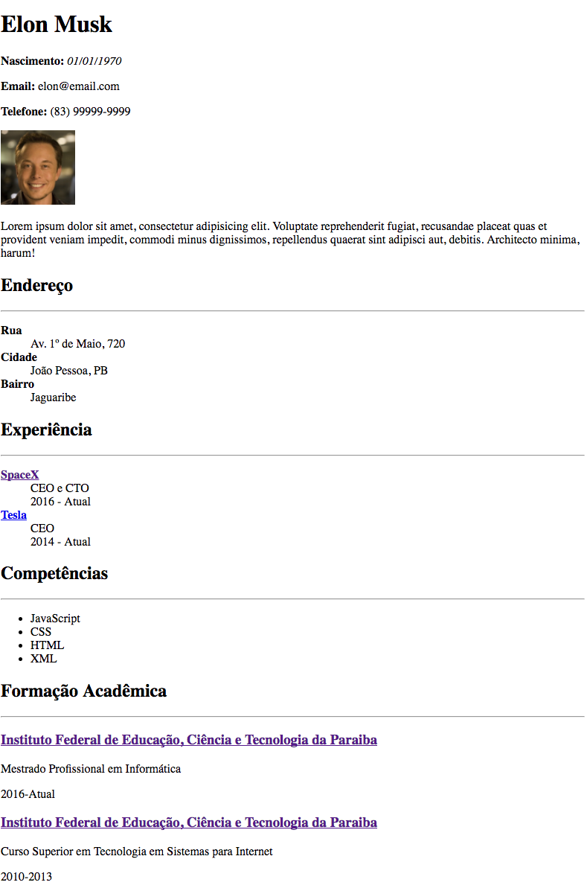

# Curriculum Vitae

## Objetivo
---

O objetivo desta atividade consiste em abordar os seguintes tópicos:

- Reconstruir uma página Web Existente
- Criar um texto com ênfase e destaque.
- Criar uma imagem
- Criar um hyperlink
- Criar uma lista não ordenada
- Criar uma lista de definição
- Criar seções com linhas horizontais
  
## Descrição
---

O Elon Musk gostaria de criar seu Curriculum Vitae, e ao saber do aumento de especialista do IFPB em HTML, logo resolveu contratar alguém.

A princípio ele forneceu, textualmente, algumas informações que estão disponíveis no arquivo compactado [site.zip](site.zip). Nele encontram-se sua foto e algumas descrições, que juntos deverão ser apresentados em um navegador Web, conforme ilustra a *Figura 1*. Observe também que a estrutura do arquivo compactado é:

```
site
├── img
│   └── elon.jpg
└── index.html
```

*Figura 1* - Layout do Currículum


> [Alternativa de resposta](site-response/)