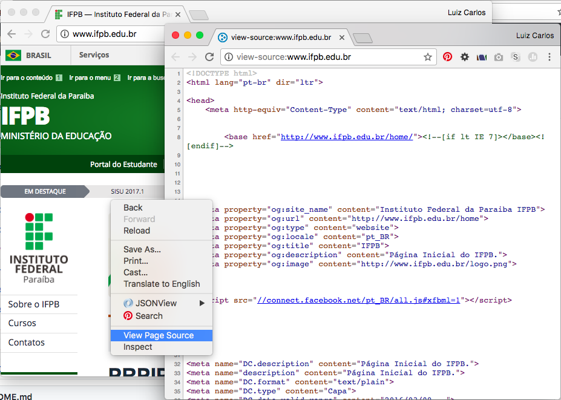
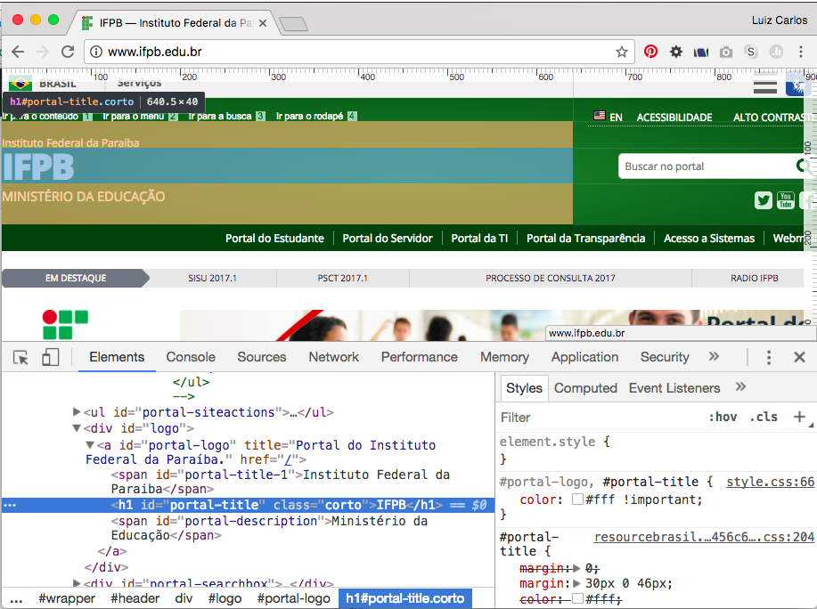
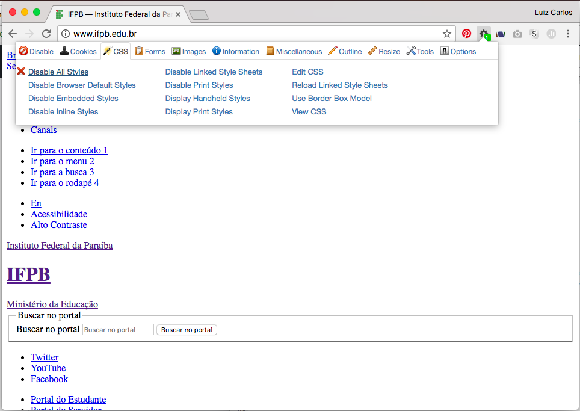

# Analisando uma Página da Web

## Objetivo
---

O objetivo desta atividade consiste em abordar os seguintes tópicos:

- Analisar uma página da Web utilizando a opção Ver Código Fonte
- Inspecionar uma página com a Ferramenta de Desenvolvedor do Browser
- Desabilitar CSS com o Plugin Web Developer
- Editando a cópia do HTML
  
## Descrição
---

Uma página Web, como a do [IFPB](http://www.ifpb.edu.br/), possui muitos detalhes, e geralmente podem ser analisados parcialmente no próprio navegador.

Isso se justifica pela própria natureza da Web, pois as páginas são estruturadas e publicadas em arquivos disponíveis na Internet por meio de servidores, e que podem ser copiados por navegadores. 

Inclusive, a maioria dos navegadores disponibilizam opções para facilitar o acesso e análise desses recursos, desta forma se torna possível analisar a forma como o site foi estruturado. Mas, como e onde eu encontro usar essas opções?

Um exemplo dessa análise, pode ser visto na *Figura 1* ao acessar uma página do [IFPB](http://www.ifpb.edu.br/) usando o Google Chrome, pois no item **Ver Código Fonte** do menu popup, é possível ver que outra janela é aberta com o código fonte utilizado para construir a página.

*Figura 1* - Código fonte da página do IFPB.


Ao percorrer esse arquivo, conseguimos ver todo o código fonte utilizado para criar as estruturas da página. Junto com o arquivo, também se identifica vários outros arquivos usados na página, como imagens (.png), estilos (.css) e javascript (.js).

Mas essa não é a única opção, existe outra alternativa de analisar o código fonte de uma página Web usando a **Ferramenta de Desenvolvedor** dos navegadores. A *Figura 2* ilustra como ela pode ser exibida no Google Chrome, logo abaixo da exibição da página.

*Figura 2* - Ferramenta do Desenvolvedor.


Um modo bastante fácil de acessar essa ferramenta é através do menu popup, por exemplo, para saber como é a estrutura do HTML do título IFPB, visível na *Figura 2*, basta ativar o item **Inspecionar Elemento** menu popup, sob o título.

Perceba que tal ação evidencia na ferramenta, o código; e no site, o título. O que nos permite concluir que a linha responsável por exibir o título é:

```
<h1 id="portal-title" class="corto">IFPB</h1>
```

> Nessa ferramenta também é possível editar temporariamente a cópia da página Web obtida!

Veja que nesta ferramenta existe várias guias com informações específicas, por exemplo, a aba network permite detalhar os recursos solicitados para exibir a página. Então fica até mais fácil saber quantos arquivos no total foram solicitados.

Outro recurso que pode ser atrelado ao navegador, para auxiliar na análise do código fonte de uma página Web, seria o uso do **[Plugin Web Developer](https://chrome.google.com/webstore/detail/web-developer/bfbameneiokkgbdmiekhjnmfkcnldhhm)** que é disponível na maioria dos navegadores.

Com esse plugin é possível isolar a estrutura do estilo da página, além de interromper a execução das ações e animações de uma página, por exemplo, a *Figura 3* exibe a página do IFPB sem nenhum estilo.

*Figura 3* - Plugin Web Developer.


Um fato importante que pode ser visto na *Figura 3*, é que através da ocultação do estilo, fica claro identificar o seu papel numa página Web, pois foi com uso do estilo que a página do IFPB conseguiu configurar a forma como as estruturas (parágrafos, títulos, hyperlink, formulários, imagens, etc) seriam exibidas.

Um exemplo perceptível são os hyperlinks, sem o estilo eles se apresentam com a forma clássica, em azul e com sublinhado, já com estilo as cores são personalizadas e o sublinhado é removido.

Portanto, como foi descrito, as opções de **Ver Código Fonte**, **Ferramenta de Desenvolvedor** e **Plugin Web Developer** facilitam o acesso ao código fonte das páginas Web.

Por fim, tente explorá-las na página do [IFPB](http://www.ifpb.edu.br/), em mais de duas páginas, e tente identificar que marcações são utilizados em algumas estruturas das páginas.
