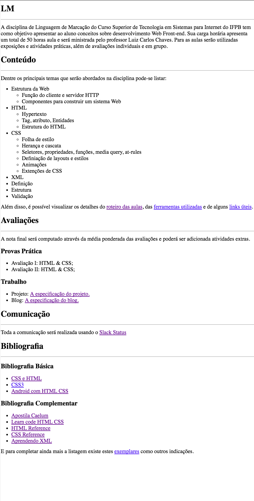

# Página da Disciplina LM

## Objetivo
---

O objetivo desta atividade consiste em abordar os seguintes tópicos:

- Reconstruir uma página Web Existente
- Criar um hyperlink
- Criar uma lista não ordenada
- Criar uma lista encandeada
- Criar seções com linhas horizontais
  
## Descrição
---

Digamos que o proforessor da disciplina esqueceu de fazer backup dos seus arquivos de aula e perdeu toda a página da disciplina em seu computador. Mas por sorte, ao acessar o github do período passado, ainda foi possível recuperar um esboço da página dentro da imagem da *Figura 1*.

Portanto, o professor está pedindo ajuda aos alunos do IFPB para recriarem a página da disciplina, mas de modo que se preserve a organização original da *Figura 1*. Vale salientar que, textualmente, algumas informações estarão disponíveis no arquivo compactado [site.zip](site.zip).

*Figura 1* - Página da disciplina

> [Alternativa de resposta](site-response/)
