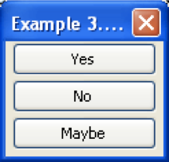
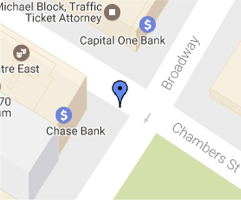

# Markup Language

* [Definition](#definition)
* [Problem](#problem)
  * [Markdown](#markdown)
  * [LaTeX](#latex)
  * [XML](#xml)
  * [HTML](#html)
  * [Comparing](#comparing)
* [Markups](#markups)
  * [SVG Image ](#svg-image )
  * [XUL Interface ](#xul-interface )
  * [MathML Expression ](#mathml-expression )
  * [KML Point ](#kml-point )
* [Remember](#remember)

## Definition
---

Reference:
* [Markup Language](https://en.wikipedia.org/wiki/Markup_language)
* [List of Markups Languages](https://en.wikipedia.org/wiki/List_of_markup_languages)
* [List of Document Markup Languages](https://en.wikipedia.org/wiki/List_of_document_markup_languages)
* [List of XML Markup Languages](https://en.wikipedia.org/wiki/List_of_XML_markup_languages)

> "A markup language is a system for annotating a document in a way that is syntactically distinguishable from the text" [Merriam-Webster Dictionary](https://en.wikipedia.org/wiki/Merriam-Webster)

## Problem
---

Styling ([`text.txt`](text.txt)):
```txt
Lorem ipsum dolor
Lorem ipsum dolor sit amet, consectetur adipisicing elit, sed do eiusmod tempor incididunt ut labore et dolore magna aliqua. Ut enim ad minim veniam, quis nostrud exercitation ullamco laboris nisi ut aliquip ex ea commodo consequat. Duis aute irure dolor in reprehenderit in voluptate velit esse cillum dolore eu fugiat nulla pariatur. Excepteur sint occaecat cupidatat non proident, sunt in culpa qui officia deserunt mollit anim id est laborum.
```

Output:

<div style="border-radius: 0.3rem;background-color: #f3f6fa;border: solid 1px #dce6f0; padding: 0.8rem;">
  <h1 style="color:#000">Lorem ipsum dolor</h1>
  <p><i>Lorem</i> ipsum <b>dolor</b> sit amet, consectetur adipisicing elit, sed do eiusmod tempor incididunt ut labore et dolore magna aliqua. Ut enim ad minim veniam, quis nostrud exercitation ullamco laboris nisi ut aliquip ex ea commodo consequat. Duis aute irure dolor in reprehenderit in voluptate velit esse cillum dolore eu fugiat nulla pariatur. Excepteur sint occaecat cupidatat non proident, sunt in culpa qui officia deserunt mollit anim id est laborum.</p>
</div>

### Markdown

Reference: 
* [Sintax](https://daringfireball.net/projects/markdown/syntax)
* [Cheatsheet](https://github.com/adam-p/markdown-here/wiki/Markdown-Cheatsheet)
* [Markdown Preview (vscode)](https://code.visualstudio.com/docs/languages/markdown#_markdown-preview)

[`text.md`](text.md):
```md
# Lorem ipsum dolor

*Lorem* ipsum **dolor** sit amet, consectetur adipisicing elit, sed do eiusmod tempor incididunt ut labore et dolore magna aliqua. Ut enim ad minim veniam, quis nostrud exercitation ullamco laboris nisi ut aliquip ex ea commodo consequat. Duis aute irure dolor in reprehenderit in voluptate velit esse cillum dolore eu fugiat nulla pariatur. Excepteur sint occaecat cupidatat non proident, sunt in culpa qui officia deserunt mollit anim id est laborum.
```

Output:

<div style="border-radius: 0.3rem;background-color: #f3f6fa;border: solid 1px #dce6f0; padding: 0.8rem;">
  <h1 style="color:#000">Lorem ipsum dolor</h1>
  <p><em>Lorem</em> ipsum <strong>dolor</strong> sit amet, consectetur adipisicing elit, sed do eiusmod tempor incididunt ut labore et dolore magna aliqua. Ut enim ad minim veniam, quis nostrud exercitation ullamco laboris nisi ut aliquip ex ea commodo consequat. Duis aute irure dolor in reprehenderit in voluptate velit esse cillum dolore eu fugiat nulla pariatur. Excepteur sint occaecat cupidatat non proident, sunt in culpa qui officia deserunt mollit anim id est laborum.</p>
</div>


### LaTeX

Reference: 
* [Sintax](https://daringfireball.net/projects/markdown/syntax)
* [Cheatsheet](https://github.com/adam-p/markdown-here/wiki/Markdown-Cheatsheet)
* [Editor](https://www.overleaf.com/9385056rmtvknmdwshj)

[`text.tex`](text.tex):
```tex
\documentclass{article}

\begin{document}

\section*{Lorem ipsum dolor}

\textit{Lorem} ipsum \textbf{dolor} sit amet, consectetur adipisicing elit, sed do eiusmod tempor incididunt ut labore et dolore magna aliqua. Ut enim ad minim veniam, quis nostrud exercitation ullamco laboris nisi ut aliquip ex ea commodo consequat. Duis aute irure dolor in reprehenderit in voluptate velit esse cillum dolore eu fugiat nulla pariatur. Excepteur sint occaecat cupidatat non proident, sunt in culpa qui officia deserunt mollit anim id est laborum.

\end{document}
```

Output: [overleaf](https://www.overleaf.com/read/jnwdkvgmrnzb)
<!-- Read & Edit Link: https://www.overleaf.com/9385056rmtvknmdwshj -->

### XML

Reference: 
* [Sintax](https://www.w3.org/TR/xml/)

[`text.xml`](text.xml):
```xml
<text>
  <title>Lorem ipsum dolor</title>
  <paragraph><italic>Lorem</italic> ipsum <bold>dolor</bold> sit amet, consectetur adipisicing elit, sed do eiusmod tempor incididunt ut labore et dolore magna aliqua. Ut enim ad minim veniam, quis nostrud exercitation ullamco laboris nisi ut aliquip ex ea commodo consequat. Duis aute irure dolor in reprehenderit in voluptate velit esse cillum dolore eu fugiat nulla pariatur. Excepteur sint occaecat cupidatat non proident, sunt in culpa qui officia deserunt mollit anim id est laborum.</paragraph>
</text>
```

### HTML

Reference: 
* [Sintax](https://www.w3.org/TR/html/)

[`text.html`](text.html):
```html
<h1>Lorem ipsum dolor</h1>
<p><i>Lorem</i> ipsum <b>dolor</b> sit amet, consectetur adipisicing elit, sed do eiusmod tempor incididunt ut labore et dolore magna aliqua. Ut enim ad minim veniam, quis nostrud exercitation ullamco laboris nisi ut aliquip ex ea commodo consequat. Duis aute irure dolor in reprehenderit in voluptate velit esse cillum dolore eu fugiat nulla pariatur. Excepteur sint occaecat cupidatat non proident, sunt in culpa qui officia deserunt mollit anim id est laborum.</p>
```

Output:

<div style="border-radius: 0.3rem;background-color: #f3f6fa;border: solid 1px #dce6f0; padding: 0.8rem;">
  <h1 style="color:#000">Lorem ipsum dolor</h1>
  <p><i>Lorem</i> ipsum <b>dolor</b> sit amet, consectetur adipisicing elit, sed do eiusmod tempor incididunt ut labore et dolore magna aliqua. Ut enim ad minim veniam, quis nostrud exercitation ullamco laboris nisi ut aliquip ex ea commodo consequat. Duis aute irure dolor in reprehenderit in voluptate velit esse cillum dolore eu fugiat nulla pariatur. Excepteur sint occaecat cupidatat non proident, sunt in culpa qui officia deserunt mollit anim id est laborum.</p>
</div>


### Comparing

| estrutura | .md | .tex | .xml | .html |
|-|-|-|-|-|
| <span style="font-size: 2rem; font-weight: bold;">Title</span> | \# |  \section* | \<title> | \<h1> |
| paragraph | quebra de linha | quebra de linha | \<paragraph> | \<p> |
| <i>Italic</i> | \* | \textit | \<italic> | \<i> |
| <b>Bold</b> | \** | \textbf | \<bold> | \<b> |

## Markups
---

### SVG Image 

Reference: 
* [Syntax](https://www.w3.org/Graphics/SVG/)

[`imagem.svg`](imagem.svg):
```xml
<svg version="1.1"
     baseProfile="full"
     width="300" height="200"
     xmlns="http://www.w3.org/2000/svg">
  <rect width="100%" height="100%" fill="red" />
  <circle cx="150" cy="100" r="80" fill="green" />
  <text x="150" y="125" font-size="60" text-anchor="middle" fill="white">SVG</text>
</svg>
```

Output:

<svg version="1.1"
     baseProfile="full"
     width="300" height="200"
     xmlns="http://www.w3.org/2000/svg">
  <rect width="100%" height="100%" fill="red" />
  <circle cx="150" cy="100" r="80" fill="green" />
  <text x="150" y="125" font-size="60" text-anchor="middle" fill="white">SVG</text>
</svg>

### XUL Interface 

Reference: 
* [Syntax](https://developer.mozilla.org/en-US/docs/Mozilla/Tech/XUL)

[`interface.xul`](interface.xul):
```xml
<?xml version="1.0"?>
<?xml-stylesheet href="chrome://global/skin/"
type="text/css"?>
<window id="vbox example" title="Example 3...."
xmlns="http://www.mozilla.org/keymaster/gatekeeper/
there.is.only.xul">
  <vbox>
    <button id="yes1" label="Yes"/>
    <button id="no1" label="No"/>
    <button id="maybe1" label="Maybe"/>
  </vbox>
</window>
```

Output:



### MathML Expression 

Reference: 
* [Syntax](https://www.w3.org/TR/MathML/)

[`mathml.xml`](mathml.xml):
```xml
<?xml version="1.0" encoding="UTF-8"?>
  <!DOCTYPE math PUBLIC
"-//W3C//DTD MathML 2.0//EN"
     "http://www.w3.org/Math/DTD/mathml2/mathml2.dtd">
  <math xmlns="http://www.w3.org/1998/Math/MathML">
    <mrow>
      <mi>a</mi>
      <mo>&InvisibleTimes;</mo>
      <msup>
        <mi>x</mi>
        <mn>2</mn>
      </msup>
      <mo>+</mo>
      <mi>b</mi>
      <mo>&InvisibleTimes; </mo>
      <mi>x</mi>
      <mo>+</mo>
      <mi>c</mi>
    </mrow>
  </math>
```

Output:


<!-- axˆ2 + bx + c (LaTex) -->

### KML Point 

Reference: 
* [Syntax](http://www.opengeospatial.org/standards/kml/)
* [KML Google](https://developers.google.com/kml/documentation/kmlreference)

[`point.kml`](point.kml):
```xml
<?xml version="1.0" encoding="UTF-8"?>
<kml xmlns="http://www.opengis.net/kml/2.2">
<Document>
<Placemark>
  <name>New York City</name>
  <description>New York City</description>
  <Point>
    <coordinates>-74.006393,40.714172,0</coordinates>
  </Point>
</Placemark>
</Document>
</kml>
```

Output:



<!-- TODO
### VoiceXML
https://en.wikipedia.org/wiki/VoiceXML -->

<!-- TODO 
### X3D
https://en.wikipedia.org/wiki/X3D -->

## Remember
---

* Markup Language helps define structures and data
* Each Markup Language has specific markers (symbolic or nominal) defined by standards
* ⬇︎ Marker = ⬇︎ File size
* Markers require specific programs (manipulation and visualization)
